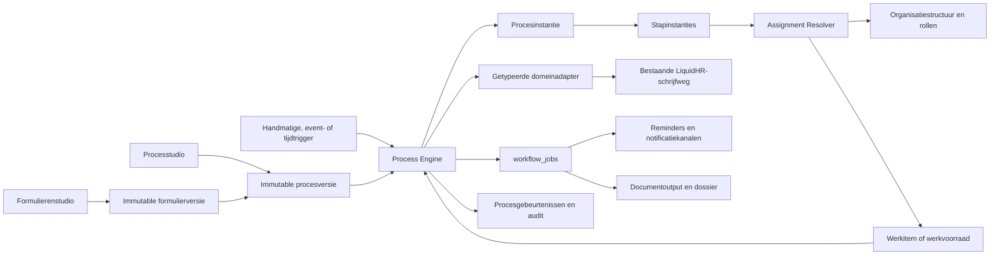
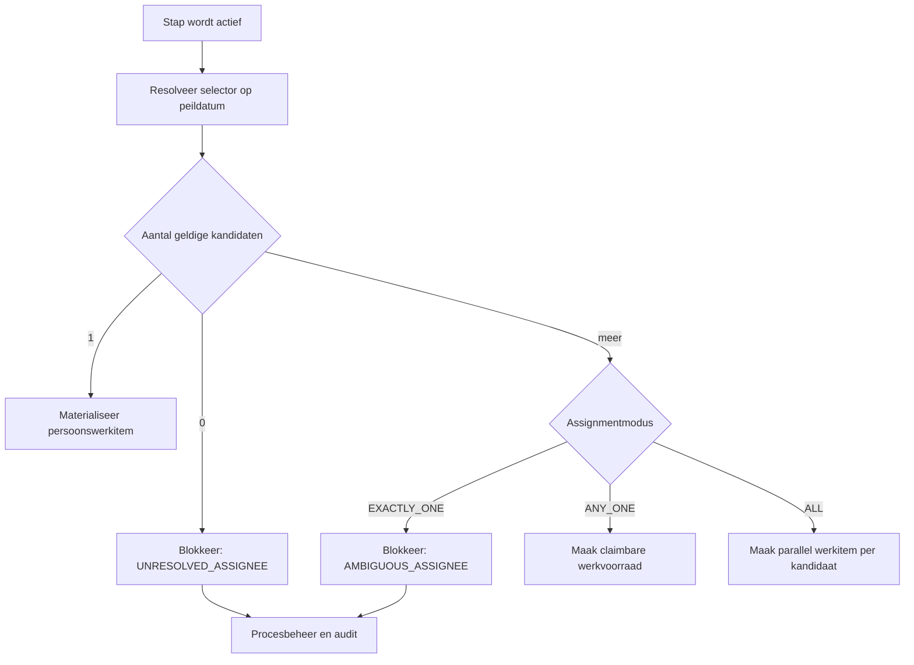

# LiquidHR Process Automation

## Hoofdplan voor workflows, formulieren en iedere procesautomatisering

**Status:** PRODUCTRICHTING GOEDGEKEURD - P0-uitwerking en functionele implementatie nog niet gestart

**Datum:** 3 augustus 2026

**Doelgroep:** product owner, architect, ontwikkelaar en uitvoerende AI-modellen zoals Luna

**Besluitbevestiging:** Edwin heeft op 3 augustus 2026 de tien productkeuzes uit hoofdstuk 19 bevestigd. AI-functionaliteit in het product blijft uitdrukkelijk geparkeerd totdat de menselijke runtime aantoonbaar werkt.

**Historische inspiratie:** *Pmutatie Module instructieboek 0.3* voor UNIT4 Emplaza, versie 0.3 van 1 november 2011

**Leidende LiquidHR-bronnen:** `AGENTS.md`, `docs/README.md`, de vijf architectuurdocumenten, autorisatie, organisatie, organogram, multitenancy, entiteiteigendom, documenten en reminders

> Dit document ontwerpt de richting en de uitvoering. De productrichting is bevestigd, maar dit document voert zelf geen schema-, API-, UI-, remote database-, seed-, deployment- of permissiewijziging uit.

## Leeswijzer

- **Deel A - Productrichting:** hoofdstuk 1 t/m 5 vertaalt het oude pMutatie-concept naar LiquidHR en bepaalt waar de module in de app komt.
- **Deel B - Architectuur en veiligheid:** hoofdstuk 6 t/m 11 beschrijft modules, assignment, formulieren, runtime, data, RLS en audit.
- **Deel C - Het pronkstuk:** hoofdstuk 12 t/m 14 beschrijft de studio's, Procesproef, showcase en veilige AI-rol.
- **Deel D - Uitvoering:** hoofdstuk 15 t/m 20 verdeelt het werk in gated slices en geeft een kopieerbare AI-instructie.
- **Deel E - Eindbeeld:** hoofdstuk 21 is de definition of done voor Process Automation als onderscheidende LiquidHR-module.

---

## 1. Samenvatting en hoofdadvies

LiquidHR moet geen losse formulierenbouwer en daarnaast een losse takenmodule krijgen. Het pronkstuk wordt één samenhangende **Process Automation**-module die vijf zaken verbindt:

1. versieerbare formulieren;
2. versieerbare procesflows;
3. concrete werkitems voor personen, rollen en werkvoorraden;
4. veilige geautomatiseerde acties naar bestaande LiquidHR-domeinen;
5. één inzichtelijke proceshistorie met audit, doorlooptijd, blokkades en output.

Het oude pMutatie-handboek bevat nog steeds sterke ideeën:

- een formulier en workflow horen inhoudelijk bij elkaar;
- een proces is een state machine en niet alleen een lijst taken;
- velden kunnen per deelnemer zichtbaar, bewerkbaar of verplicht zijn;
- huidige en nieuwe waarden moeten naast elkaar kunnen staan;
- een gebruiker moet tussentijds kunnen bewaren;
- afgeronde processen horen terugvindbaar in het dossier;
- goedkeuren, afkeuren, kennisnemen en timers zijn verschillende acties;
- een beheerder moet een formulier vanuit iedere procesrol kunnen voorvertonen;
- kopiëren, importeren, exporteren, samenvatten, bijlagen en documentgeneratie zijn waardevol.

De oude aanpak wordt niet letterlijk overgenomen. LiquidHR vermijdt honderden maatwerkworkflows, vaste codes als `P&O3`, aanpasbare actieve definities en rechtstreekse writes vanuit dynamische velden. De moderne oplossing gebruikt één generieke procesmotor met immutable versies, veilige expressies, bestaande HR-entiteiten en getypeerde domeinadapters.

### Besluit over rollen uit het organogram

**Standaard wordt een rol per stap opgelost wanneer die stap actief wordt.** Daarna wordt het resultaat als concrete, auditbare opdracht aan een persoon of kandidaatwerkvoorraad vastgelegd.

Dit is beter dan alle personen aan het begin vastleggen, omdat een proces weken kan lopen en de organisatiestructuur, manager, functie of rolhouder in de tussentijd kan veranderen. Tegelijk mag een actieve taak niet plotseling onverklaarbaar naar iemand anders springen. Daarom geldt de hybride regel:

- bij de start: route en mogelijke rolhouders alleen **vooruit simuleren**;
- bij activering van iedere stap: de rol **daadwerkelijk oplossen** op de gekozen peildatum;
- na resolutie: persoon, rol, afdeling, bron en peildatum **materialiseren** op het werkitem;
- volgende stappen: opnieuw oplossen met de dan geldige organisatiestructuur;
- een actieve taak: standaard `STICKY_UNTIL_COMPLETED`, tenzij het proces expliciet herresolutie vereist of de toegewezen persoon niet langer kan handelen;
- alleen juridisch of historisch gebonden processen mogen expliciet `SNAPSHOT_AT_START` gebruiken.

Bij meerdere geldige rolhouders kiest LiquidHR nooit stil de eerste. Het proces bepaalt vooraf één van deze assignmentmodi:

- `EXACTLY_ONE`: blokkeer met een typed ambiguity error en stuur naar procesbeheer;
- `ANY_ONE`: maak één gedeeld werkitem dat één kandidaat kan claimen;
- `ALL`: maak voor iedere kandidaat een eigen verplicht werkitem;
- `QUORUM`: laat een vooraf vastgelegd aantal deelnemers besluiten; pas in een latere fase.

Deze keuze sluit rechtstreeks aan op het bestaande LiquidHR-organisatiemodel, waarin meerdere rolhouders geldig zijn en de huidige managerresolver bewust een `AmbiguousManagerError` geeft.

---

## 2. Productvisie: van formulier naar levend proces

De gebruiker mag Process Automation niet ervaren als technische BPM-software. De module moet aanvoelen als een rustige digitale werkplek:

- **Mijn werk** vertelt wat nu aandacht nodig heeft;
- een **proceskaart** vertelt waarom de taak bestaat, voor wie, wat er al is gebeurd en wat hierna volgt;
- een **formulier** vraagt alleen wat deze deelnemer op dit moment moet weten of invullen;
- een **verschillenweergave** toont oude en voorgestelde waarden;
- een **tijdlijn** maakt besluiten en automatische acties begrijpelijk;
- **Instellingen -> Workflows en formulieren** laat een beheerder veilig ontwerpen, simuleren, publiceren en meten;
- bestaande medewerker-, dienstverband-, document-, verzuim-, verlof-, Talent- en organisatiepagina's tonen de relevante processen in hun eigen context.

De ambitie "ieder proces automatiseren" betekent niet dat iedere tabel door een willekeurig formulier beschrijfbaar wordt. Het betekent:

> Eén veilige orchestratiemotor kan ieder toegestaan LiquidHR-proces aansturen, terwijl iedere domeinmutatie via de bestaande getypeerde schrijfweg en autorisatie blijft lopen.

Dat onderscheid is essentieel. De procesmotor bepaalt **wanneer, door wie en onder welke voorwaarden** iets gebeurt. Een domeinmodule bepaalt **of en hoe** een contract, plaatsing, adres, verlofboeking of dossierdocument geldig wordt gewijzigd.

---

## 3. Canonieke begrippen

Deze woorden moeten in requirements, code en AI-opdrachten consequent worden gebruikt.

| Begrip | Betekenis |
|---|---|
| **Procesdefinitie** | De beheerbare naam, categorie, rechten, startmogelijkheden en eigenaar van een proces. |
| **Procesversie** | Een immutable, gepubliceerde versie met stappen, overgangen, voorwaarden, deelnemers en formulierverwijzingen. |
| **Procesinstantie** | Eén concrete uitvoering, bijvoorbeeld "Interne overplaatsing van medewerker X per 1 oktober". |
| **Stap** | Een toestand in het proces, bijvoorbeeld Aanvraag, Beoordeling doelmanager of HR-publicatie. |
| **Overgang** | Een toegestane actie waarmee een stap naar een volgende stap gaat. |
| **Werkitem** | De concrete actie die een persoon of werkvoorraad moet uitvoeren. |
| **Deelnemer** | Een betekenisvolle procesrol, bijvoorbeeld initiator, medewerker, bronmanager, doelmanager of HR-behandelaar. |
| **Assignmentselector** | Een declaratieve regel die een deelnemer naar één of meer concrete personen resolveert. |
| **Formulierdefinitie** | Herbruikbare inhoud en structuur van een formulier. |
| **Formulierversie** | Immutable veld-, sectie-, validatie-, vertaal- en toegangsdefinitie. |
| **Antwoordset** | De waarden van één formulier binnen één procesinstantie. |
| **Domeinadapter** | Een implementatie achter een smalle module-interface die procesdata valideert, een wijziging voorvertoont en via de bestaande domeinschrijfweg toepast. |
| **Automatiseringstaak** | Asynchroon werk zoals een timer, reminder, documentgeneratie, e-mail of integratiecall. |
| **Procesgebeurtenis** | Append-only historie van start, assignment, invoer, besluit, overgang, fout en afronding. |

Gebruikersgerichte navigatie mag **Workflows en formulieren** heten omdat dit herkenbaar is. In het domein en de nieuwe module is **proces** het overkoepelende woord.

---

## 4. Wat uit het oude handboek blijft en wat modern wordt

| Idee uit pMutatie | Behouden | Moderne LiquidHR-uitwerking |
|---|---|---|
| Workflow als state machine | Ja | Immutable procesversie met gecontroleerde overgangen en append-only events. |
| Veld zichtbaar/bewerkbaar/verplicht per rol | Ja | Per deelnemer én stap: `HIDDEN`, `READ`, `WRITE_OPTIONAL`, `WRITE_REQUIRED`. |
| Vaste P&O-/managercodes | Nee | Assignmentselectors naar bestaande `management_roles`, directe manager, initiator, medewerker, expliciete persoon of werkvoorraad. |
| Een persoon aan begin kiezen | Alleen als uitzondering | Standaard per stap oplossen en daarna materialiseren. |
| Goedkeuren, afkeuren, inzien | Ja | Typed acties: `SUBMIT`, `APPROVE`, `REJECT`, `REQUEST_CHANGES`, `ACKNOWLEDGE`, `COMPLETE`, `CANCEL`. |
| Stappen aan/uit zetten | Ja, veiliger | Voorwaarden in een allowlisted expressietaal; geen eigen code, SQL of eval. |
| Huidige en nieuwe waarden | Ja | Read-only bronprojectie, wijzigingsvoorstel en duidelijke diff vóór commit. |
| Vrije velden | Ja | Alleen versieerbare procesdata; niet automatisch een domeinwrite. |
| Gekoppelde backofficevelden | Ja | Getypeerde domeinbinding met preview/validate/apply; geen vrij configureerbare tabelkolom. |
| Helptekst, titel en scheiding | Ja | Toegankelijke contentblokken uit de LiquidHR-componentfamilie. |
| Tussentijds bewaren | Ja | Autosave, expliciete conceptstatus, versienummer en conflictmelding. |
| Print/mailmerge | Ja, anders | Server-side documentoutput met veilige tokens en opslag in het bestaande dossier. |
| Bijlagen | Ja | Bestaande private documentopslag, categorieën, signed downloads, audience en audit. |
| Takenlijst en archief | Ja | Mijn werk + proceshistorie + contexttab op medewerker/dienstverband + dossieroutput. |
| Workflow per formulier kopiëren | Ja | Procesrecepten klonen als nieuw concept, nooit actieve versie muteren. |
| ZIP import/export | Later | Gesigneerd en geschemavalideerd JSON-pakket met dry-run, dependencyrapport en versiecompatibiliteit. |
| Maatwerkcode per workflow | Nee | Generieke motor + declaratieve definitie + getypeerde domeinadapters. |
| Actief formulier verwijderen | Nee | Archiveren; gepubliceerde versies en gebruikte instanties blijven immutable en auditbaar. |

Een tweede belangrijke les uit het handboek blijft leidend: digitaliseer niet blind ieder papieren vakje of iedere bestaande handtekening. Eerst wordt het proces vereenvoudigd. Een automatische mededeling vervangt waar mogelijk een wachtrij; een vooringevulde waarde vervangt een vraag; een domeinregel vervangt een menselijke controle die niets toevoegt.

---

## 5. Plaats in de huidige LiquidHR-app

### 5.1 Bestaande bouwstenen die worden hergebruikt

De nieuwe module bouwt bovenop de huidige applicatie en introduceert geen tweede bron voor medewerkers, organisatie of documenten.

| Bestaande bouwsteen | Gebruik door Process Automation |
|---|---|
| `employees`, `employments`, `employment_contracts` | Procesonderwerp, dienstverbandcontext en bestaande write-invariants. |
| `departments`, `employee_organizations`, `department_management`, `management_roles` | Assignmentselectors en bron-/doelafdelingsscope. |
| `lib/organization/manager-resolver.ts` | Basis voor de pure organisatie-resolutie; generaliseren zonder bestaand gedrag te dupliceren. |
| Rollen- en rechtenmatrix | Publicatie-, start-, lees-, taakactie- en herverdelingsrechten. |
| `reminders` en gematerialiseerde `reminder_recipients` | Deadlines, persoonlijke opvolging en het bestaande snapshotpatroon. |
| Medewerkers- en bedrijfsdocumenten | Bijlagen, gegenereerde output, bewaarbeleid en signed downloads. |
| `audit_logs` | Centrale mutatieaudit; procesgebeurtenissen krijgen dezelfde correlation-id. |
| Afwezigheidstaken | Domeinspecifieke taakbron; later zichtbaar maken via één werkprojectie, niet direct vervangen. |
| Talentnotificaties | Domeinspecifieke bron; later projecteren in Mijn werk zonder eerste migratie te forceren. |
| Startpagina | De huidige toekomstige kaart Taken & Poortwachter kan echte werkprioriteiten gaan tonen. |
| Medewerkerdashboard | De bestaande Workflow-placeholder wordt een contextkaart en later een tab Processen. |
| Instellingenmodules | Workflows staat al als toekomstige module gereserveerd. |
| `workflow_jobs`-patroon uit de architectuur | Eén gedeelde queue voor timers, notificaties, documenten, webhooks en retries. |

### 5.2 Nieuwe navigatie

#### Voor iedere gebruiker: `/work`

Navigatienaam: **Mijn werk** of kort **Werk**.

De pagina is lijst-eerst en bevat:

- `Te doen`;
- `Werkvoorraden` waarop de gebruiker kandidaat is;
- `Wachten op anderen` voor processen die de gebruiker startte of volgt;
- `Door mij gestart`;
- `Afgerond`;
- zoeken, status, proces, deadline, afdeling, medewerker en sortering;
- een badge voor achterstallige en vandaag vervallende werkitems;
- duidelijke scheiding tussen taak, herinnering en informatieve notificatie.

Een reminder is geen goedkeuringstaak en een notificatie is geen autorisatiebron. De UI mag ze samen prioriteren, maar de onderliggende bronnen en acties blijven getypeerd.

#### Procesdetail: `/work/processes/[processInstanceId]`

Desktop:

- links de actieve formulier- of taakinhoud;
- rechts medewerker-/dienstverbandcontext, huidige versus nieuwe waarden, deelnemers, deadline en compacte tijdlijn;
- onderaan een vaste actiebalk met alleen de server-side toegestane acties;
- gevoelige velden worden niet opgehaald wanneer de deelnemer ze niet mag zien.

Mobiel:

- één kolom;
- context samengevouwen;
- grote aanraakdoelen;
- vaste onderbalk voor primaire actie;
- geen horizontale overflow.

#### Contextuele ingangen

- medewerkerdetail: tab **Processen** en kaart op het dashboard;
- dienstverbanddetail: processen die exact dit dienstverband raken;
- afdelings-/organogramcontext: toegestane processen starten voor een afdeling of medewerker;
- procescatalogus: een gebruiker ziet alleen startbare processen;
- startpagina: urgente werkitems en blokkades;
- HeRa: later zoeken, uitleggen, concept starten en typed acties voorbereiden.

#### Beheer: `/settings/process-automation`

Instellingstegel: **Workflows en formulieren**.

Werkruimtes:

1. **Procescatalogus** - lijst, categorie, status, eigenaar, versie, gebruik en impact;
2. **Processtudio** - visuele flow, deelnemers, voorwaarden, deadlines en uitkomsten;
3. **Formulierenstudio** - secties, velden, bindings, toegang en live preview;
4. **Automatiseringen** - starttriggers, timers, notificaties, output en integraties;
5. **Procesbeheer** - blokkades, fouten, werkvoorraden, herverdeling en lopende versies;
6. **Inzichten** - doorlooptijd en wachttijd per proces/stap zonder medewerkerprestatie-score.

Zoals alle beheerbare stamdata is de procescatalogus lijst-eerst: zoeken, filteren, sorteren, klikrij en modals voor korte metadata-acties. De flow- en formstudio krijgen een eigen pagina; zij zijn te groot voor een modal.

---

## 6. Doelarchitectuur



### 6.1 Diepe modules en seams

De buitenste module-interface blijft klein. Callers zoals HTTP-routes, timers, HeRa-tools en domeinevents mogen niet zelf stappen of tabellen muteren.

Voorgestelde externe interface van `lib/process-automation/`:

```ts
startProcess(command): Promise<StartProcessResult>
performWorkItemAction(command): Promise<WorkItemActionResult>
getWorkProjection(query): Promise<WorkProjection>
publishProcessDraft(command): Promise<PublishedProcessVersion>
resumeAutomationWork(command): Promise<AutomationRunResult>
```

Belangrijk:

- `performWorkItemAction` is de enige schrijfweg voor menselijke procesacties;
- de overgang, validatie, taakafronding, eventregistratie, volgende-stapactivatie en queue-inserts gebeuren atomair;
- routes zijn dun en bevatten geen eigen proceslogica;
- tests gebruiken dezelfde module-interface als callers;
- interne seams worden alleen toegevoegd wanneer er werkelijk meerdere adapters zijn.

### 6.2 Runtime versus ontwerp

De ontwerper werkt met een conceptdefinitie. Publiceren compileert deze naar een immutable runtime-artifact:

- alle step keys zijn uniek;
- iedere overgang verwijst naar geldige stappen;
- iedere niet-terminale stap heeft een uitweg;
- onbereikbare stappen worden geweigerd;
- verboden cycli worden geweigerd; alleen expliciete herstel-lussen zijn toegestaan;
- forms en domeinacties verwijzen naar bestaande gepubliceerde versies;
- iedere assignmentselector is syntactisch en semantisch geldig;
- veldrechten geven nooit méér toegang dan de deelnemer en permission toestaan;
- vertalingen, foutcodes, deadlines en terminale uitkomsten zijn compleet;
- de definitie krijgt een hash en kan daarna niet worden gewijzigd.

Lopende processen blijven op hun versie gepind. Een nieuwe publicatie raakt alleen nieuwe instanties. Migratie van lopende processen is een afzonderlijke, geaudite handeling met dry-run en expliciete mapping; nooit een stil gevolg van publiceren.

### 6.3 Voorgestelde codekaart

De exacte namen worden in P0/P1 nog tegen de actuele checkout gecontroleerd. Dit is de aanbevolen plaatsing, zodat uitvoerende modellen geen proceslogica over routes en componenten verspreiden.

```text
apps/hr-suite/
  lib/process-automation/
    definition-schemas.ts       # Draft- en compiled-contracten
    definition-compiler.ts      # Graph, veldrechten, vertalingen en hash
    condition-evaluator.ts      # Pure allowlisted expression tree
    assignment-resolver.ts      # Orchestratie rond organisatie-/persoonselectors
    process-engine.ts           # Start en atomische menselijke acties
    work-projection-service.ts  # Mijn werk en procesdetail
    automation-runner.ts        # Timers, retries en queuewerk
    domain-adapters/             # Alleen echte varianten, per ondersteund domein
  app/api/process-definitions/
  app/api/form-definitions/
  app/api/process-instances/
  app/api/process-work-items/
  app/(dashboard)/work/
  app/(dashboard)/settings/process-automation/
  components/process-automation/
  messages/nl/workflows.json
  messages/en/workflows.json
  supabase/migrations/<timestamp>_process_automation_*.sql
  supabase/tests/process_automation_*.sql
```

Kritieke bestaande aansluitpunten die per relevante slice moeten worden geïnspecteerd en gericht uitgebreid:

- `apps/hr-suite/lib/organization/manager-resolver.ts` en test;
- `apps/hr-suite/components/layout/sidebar.tsx`;
- `apps/hr-suite/app/(dashboard)/settings/page.tsx`;
- `apps/hr-suite/app/(dashboard)/dashboard/start/page.tsx` en `components/startpage/start-page.tsx`;
- `apps/hr-suite/app/(dashboard)/employees/[employeeId]/page.tsx` en het medewerkerdashboard;
- `apps/hr-suite/lib/reminders/` en de bestaande reminderroutes;
- `apps/hr-suite/lib/documents/` en de documentroutes;
- `apps/hr-suite/lib/organization/management-service.ts` en de bestaande employment-organization-writeweg;
- `packages/db/types.ts`, uitsluitend opnieuw gegenereerd na schemawijziging.

Nieuwe routes blijven dun. Nieuwe UI-componenten roepen geen losse Supabasequeries aan wanneer de pagina of projectieservice de context al heeft.

---

## 7. Assignment Resolver: persoon, rol en organogram

### 7.1 Ondersteunde selectors

Een processtap verwijst niet rechtstreeks naar willekeurige SQL of een losse e-mail. De eerste veilige selectorcatalogus is:

| Selector | Resolutie |
|---|---|
| `EXPLICIT_PERSON` | Een vooraf gekozen actieve medewerker/gebruiker binnen scope. |
| `INITIATOR` | De persoon die de procesinstantie startte. |
| `SUBJECT_EMPLOYEE` | De medewerker die onderwerp van het proces is. |
| `DIRECT_MANAGER_OF_SUBJECT` | Direct manager via actuele plaatsing en bestaande resolver. |
| `MANAGEMENT_ROLE_ON_SUBJECT_DEPARTMENT` | Rolhouder op huidige afdeling of geldige ancestor. |
| `MANAGEMENT_ROLE_ON_SELECTED_DEPARTMENT` | Rolhouder op een in een gecontroleerd veld gekozen doelafdeling. |
| `MANAGEMENT_ROLE_ON_PROCESS_DEPARTMENT` | Rolhouder op de afdeling die als procescontext is vastgelegd. |
| `FORM_FIELD_PERSON` | Persoon uit een expliciet typed person-referenceveld. |
| `PERMISSION_WORK_QUEUE` | Kandidaten binnen scope met exact de vereiste permission; alleen met begrensde resolver. |
| `PROCESS_OWNER_QUEUE` | Veilige beheerwerkvoorraad voor blokkades en uitzonderingen. |

`FORM_FIELD_PERSON` en `MANAGEMENT_ROLE_ON_SELECTED_DEPARTMENT` mogen alleen verwijzen naar velden die als typed reference in de gepubliceerde formulierversie bestaan. Een tekstveld met een naam is nooit een identiteit.

### 7.2 Resolutiemoment en peildatum

Iedere selector krijgt één expliciete `resolution_date_policy`:

- `STEP_ACTIVATED_AT` - standaard en aanbevolen;
- `PROCESS_STARTED_AT` - voor stabiele routebehoefte;
- `BUSINESS_EFFECTIVE_DATE` - bijvoorbeeld de ingangsdatum van een overplaatsing;
- `FIXED_DATE_FIELD` - alleen een typed datumveld uit het proces;
- `SNAPSHOT_AT_START` - alleen na expliciet functioneel besluit.

De resolver retourneert niet alleen een persoon, maar ook bewijs:

- selector type en configuratie;
- resolved employee/user;
- rolcode en `management_role_id` indien van toepassing;
- bronafdeling en eventueel ancestorpad;
- peildatum;
- bron `direct`, `department`, `ancestor`, `explicit`, `queue` of later `deputy`;
- kandidaten en reden van selectie;
- definitie- en instantierevisie.

Deze gegevens worden als assignment snapshot bewaard. Geen secrets of overtollige persoonsgegevens worden in dit bewijs opgenomen.

### 7.3 Wat gebeurt bij organisatiewijziging?

1. Een nog niet actieve toekomstige stap heeft nog geen definitieve persoon en resolveert bij activering opnieuw.
2. Een actief persoonswerkitem blijft standaard bij de toegewezen persoon.
3. Voor de actie controleert de server dat het werkitem nog open is, de actor de concrete assignee of geldige claimant is en de permission/scope nog bestaat.
4. Verliest de persoon zijn account, toestemming of geldige deelname, dan wordt het werkitem `BLOCKED_ASSIGNMENT` en volgens het ingestelde beleid herresolved of naar procesbeheer gestuurd.
5. Een werkvoorraad kan kandidaten bij openen of claimen opnieuw valideren, maar de claim zelf wordt atomair en auditbaar vastgelegd.

### 7.4 Geen, één of meerdere kandidaten



### 7.5 Deputy en afwezigheid

De bestaande modellen kennen deputyrelaties, maar automatische activatie mag alleen via een betrouwbare afwezigheidsbeslissing. Tot die bron functioneel is vastgesteld:

- de procesmotor activeert geen deputy op basis van een vermoeden;
- een beheerder kan een taak alleen met `workflow-task:reassign` expliciet en geauditeerd herverdelen;
- het proces bewaart de oorspronkelijke resolutie en de reden van herverdeling;
- later kan de resolver de bestaande deputyseam gebruiken met een aantoonbare `unavailable`-beslissing.

---

## 8. Formulierenmotor

### 8.1 Formulier is presentatie én contract

Een formulierversie beschrijft:

- secties en volgorde;
- velden en typed waarden;
- labels, helptekst en vertalingen;
- client- en servervalidatie;
- conditionele zichtbaarheid;
- deelnemer-/staprechten;
- databinding of proces-only opslag;
- dataclassificatie en bewaarbeleid;
- samenvatting en outputtokens;
- toegankelijkheidsmetadata.

Systeemcopy en foutcodes blijven in `messages/nl/workflows.json` en `messages/en/workflows.json`. Tenantinhoud is dynamische configuratie: iedere publiceerbare definitie bevat minimaal Nederlandse tekst en, wanneer Engels voor de tenant actief is, ook Engelse tekst. De publicatiegate weigert ontbrekende verplichte lokale inhoud.

### 8.2 Veldtypen voor de eerste volwassen versie

#### Invoer

- korte tekst;
- lange tekst;
- integer en decimaal;
- geldbedrag met valuta;
- datum, tijd en datum/tijd;
- ja/nee;
- single-select en multi-select uit een beheerbare of getypeerde bron;
- medewerkerreferentie;
- afdelingreferentie;
- functiereferentie;
- dienstverbandreferentie;
- document-/bijlagereferentie;
- herhaalbare groep, pas nadat de basis stabiel is.

#### Presentatie

- titel, uitleg, waarschuwing en scheiding;
- read-only contextkaart;
- huidige-versus-nieuwe-waarde;
- documentlink;
- berekende samenvatting;
- processtatus en vorige besluiten.

#### Binding

- `PROCESS_ONLY`: alleen onderdeel van het procesdossier;
- `DOMAIN_READ`: voorgedefinieerde read-only projectie uit een domeinadapter;
- `DOMAIN_PROPOSAL`: wijzigingsvoorstel dat pas bij een getypeerde commitstap wordt toegepast;
- `COMPUTED`: server-side berekende, niet vrij te wijzigen waarde.

Een beheerder kiest nooit een tabelnaam of kolomnaam. Bindings komen uit een door ontwikkelaars geleverde registry, bijvoorbeeld `employment.organizationChange.targetDepartment`. Daardoor kunnen schemawijzigingen gecontroleerd worden gemigreerd en kan geen formulierenbouwer RLS of businessregels omzeilen.

### 8.3 Veldrechten

Per veld, stap en deelnemer bestaat exact één accessmodus:

- `HIDDEN`;
- `READ`;
- `WRITE_OPTIONAL`;
- `WRITE_REQUIRED`.

Regels:

- `WRITE_REQUIRED` impliceert zichtbaar en bewerkbaar;
- een hidden veld wordt niet alleen verborgen, maar ontbreekt in de serverresponse;
- een readonly waarde wordt server-side opnieuw geladen of gecontroleerd en niet uit de client vertrouwd;
- een voorwaarde kan een veld verbergen of verplicht maken, maar nooit de securityscope vergroten;
- medische, salaris- en andere gevoelige bindings vereisen naast procesdeelname de bestaande domeinpermission;
- een formulier mag nooit als zijdeur toegang geven tot een veld dat de actor buiten het proces niet mag lezen.

### 8.4 Voorwaarden zonder willekeurige code

Voorwaarden worden opgeslagen als een getypeerde expression tree met allowlisted operators:

- `equals`, `notEquals`;
- `in`, `notIn`;
- `isEmpty`, `isNotEmpty`;
- `greaterThan`, `lessThan` voor passende types;
- `and`, `or`, `not`;
- verwijzing naar procesveld, subjectmetadata of gecontroleerde domeinuitkomst.

Niet toegestaan:

- JavaScript, SQL, regex van tenantgebruikers, templatecode of `eval`;
- toegang tot een niet-gepubliceerd of hidden veld;
- vrije datum-/geldberekeningen die bestaande domeinengines dupliceren;
- AI die tijdens runtime zelf een conditie verzint.

De compiler controleert typecompatibiliteit en detecteert onmogelijke of circulaire afhankelijkheden.

### 8.5 Draft, autosave en concurrency

- Een antwoordset heeft een monotone `version`.
- Autosave verstuurt alleen gewijzigde velden met `expectedVersion`.
- Een conflict toont welke waarden sinds openen zijn gewijzigd; nooit stil overschrijven.
- Een stapactie valideert alle op dat moment vereiste velden opnieuw.
- Iedere succesvolle overgang legt een immutable antwoordrevisie of hash vast.
- Voor gevoelige processen kan een expliciete bevestiging nodig zijn vóór `SUBMIT` of `APPROVE`.

### 8.6 Samenvatting, documenten en bijlagen

De oude print/mailmergegedachte wordt als volgt gemoderniseerd:

- live samenvatting met labels, oude/nieuwe waarde, deelnemers en besluiten;
- server-side PDF of DOCX-output vanuit veilige, versieerbare tokens;
- gegenereerde output krijgt procesversie, instance-id en auditcorrelation;
- opslag via het bestaande medewerkers- of bedrijfsdossier;
- private bucket, signed download en bestaande audience-/permissioncontrole;
- bijlagen worden documentreferenties, geen losse blobs in proces-JSON;
- archiveren is standaard; fysiek verwijderen alleen volgens bewaarbeleid en rechten.

---

## 9. Procesmotor

### 9.1 Staptypen

De eerste catalogus moet klein maar krachtig zijn.

| Staptype | Doel |
|---|---|
| `FORM` | Een deelnemer vult of controleert gegevens. |
| `DECISION` | Goedkeuren, afkeuren of wijzigingen vragen. |
| `ACKNOWLEDGEMENT` | Kennisnemen zonder goedkeuringsmacht. |
| `AUTOMATED_COMMAND` | Een getypeerde domeinactie previewen of uitvoeren. |
| `WAIT_UNTIL` | Wachten tot datum/tijd of gecontroleerde gebeurtenis. |
| `NOTIFICATION` | In-app/reminder/e-mailopdracht zonder besluitrecht. |
| `DOCUMENT_OUTPUT` | Samenvatting of document genereren en opslaan. |
| `PARALLEL_FORK` | Meerdere onafhankelijke takken starten. |
| `PARALLEL_JOIN` | Wachten op `ALL`, later eventueel `ANY` of `QUORUM`. |
| `END` | Expliciete uitkomst zoals voltooid, afgewezen of geannuleerd. |

Een subprocesstap, vrij script, menselijke e-signature en complexe quorumregels zijn geen fase-1-kern. Zij kunnen later worden toegevoegd zonder de runtimebasis te veranderen.

### 9.2 Statusmodellen

#### Procesdefinitie

`DRAFT -> PUBLISHED -> RETIRED`

- publiceren maakt een nieuwe versie;
- published is immutable;
- retired kan niet meer worden gestart, maar blijft leesbaar voor historie.

#### Procesinstantie

- `DRAFT` - initiator is begonnen maar nog niet verzonden;
- `RUNNING` - minstens één stap actief;
- `WAITING` - alleen timers/async werk actief;
- `BLOCKED` - assignment, configuratie of uitvoerfout vereist aandacht;
- `COMPLETED` - terminale succesvolle uitkomst;
- `REJECTED` - terminale afwijzing wanneer het proces dit onderscheid nodig heeft;
- `CANCELLED` - geautoriseerd afgebroken;
- `FAILED` - niet-herstelbaar technisch beëindigd; zeldzaam en nooit gebruikt voor gewone afwijzing.

#### Werkitem

- `OPEN`;
- `CLAIMED`;
- `COMPLETED`;
- `CANCELLED`;
- `EXPIRED`.

### 9.3 Transactie en idempotentie

`performWorkItemAction` moet in één database-transactie:

1. procesinstantie en werkitem locken;
2. `expectedVersion` en idempotency key controleren;
3. actor, concrete assignment, permission en scope valideren;
4. toegestane actie uit de gepubliceerde definitie controleren;
5. formulier- en domeinvalidatie uitvoeren;
6. werkitem afronden;
7. stap afronden en overgang kiezen;
8. procesgebeurtenis en centrale audit schrijven;
9. volgende stappen activeren en assignments materialiseren;
10. timers, reminders, documenten en integratiewerk in `workflow_jobs` plaatsen;
11. nieuwe instanceversion retourneren.

Dubbelklikken, browserretry of webhookretry mag nooit een tweede overgang, document, reminder of domeinmutatie veroorzaken.

### 9.4 Afwijzen en wijzigingen vragen

Niet iedere negatieve actie betekent terug naar de initiator.

De ontwerper kiest expliciet:

- terminale afwijzing;
- terug naar een benoemde herstelstap;
- terug naar de vorige invuller;
- wijzigingen vragen zonder eerder besluit te vernietigen;
- annuleren door initiator zolang nog geen onomkeerbare commit plaatsvond.

De historie blijft append-only. Een gecorrigeerde antwoordset vervangt niet stil de eerdere revisie.

### 9.5 Timers, SLA en escalatie

- deadlines worden server-side berekend uit stapactivatie of zakelijke datum;
- werkdagenberekening komt uit een getypeerde kalenderadapter en niet uit een losse optelling;
- reminderjobs zijn idempotent en bevatten minimale persoonsgegevens;
- escalatie kan informeren, herverdelen of blokkeren, maar verleent nooit vanzelf nieuwe permissions;
- `workflow_jobs` gebruikt `available_at`, attempts, backoff, status, idempotency key en dead-letterinformatie;
- snelle jobs mogen na de request via `after()` worden gedraind; een externe scheduler is het vangnet.

### 9.6 Triggers

Een proces kan starten door:

- een bevoegde gebruiker;
- een medewerker voor zichzelf;
- een toegestane actie vanuit medewerker, dienstverband, afdeling of organogram;
- een allowlisted domeingebeurtenis;
- een datum-/tijdregel;
- een versiegebonden webhook of externe integratie;
- later een typed HeRa-tool na expliciete bevestiging.

Triggers bevatten geen vrije SQL. Domeinevents krijgen een registry met type, versie, minimale payload en resolver naar tenant/administratie/subject.

---

## 10. Voorgesteld logisch datamodel

Dit is richtinggevend. De uitvoeringsslice moet vóór migratie bestaande tabellen, enums, grants, RLS-helpers en naamconflicten opnieuw inventariseren.

### 10.1 Tenant-owned ontwerpdata

| Tabel | Kernrol |
|---|---|
| `process_definitions` | Metadata, code, categorie, eigenaar, startpermissions en status. |
| `process_definition_drafts` | Bewerkbaar concept met JSON-definitie, editversion en laatste validatorrapport. |
| `process_versions` | Immutable compiled definition, semver/sequence, hash, publisher en tijdstip. |
| `form_definitions` | Herbruikbare formuliermetadata. |
| `form_definition_drafts` | Bewerkbaar formulierconcept. |
| `form_versions` | Immutable compiled formschema, vertalingen, bindingmanifest en hash. |
| `process_administration_availability` | Optionele beschikbaarheid per administratie zonder eigendom te verplaatsen. |

Proces- en formcatalogi zijn tenant-owned. Een administratiecookie maakt ze niet administration-owned. Beschikbaarheid en startrechten kunnen wel per administratie worden begrensd.

### 10.2 Runtime met expliciete scopevariant

| Tabel | Kernrol |
|---|---|
| `process_instances` | Concrete run, pinned version, tenant, expliciete `scope_type`, optionele verplichte administratie, subject en status. |
| `process_step_instances` | Runtime-status per stap, activatie/afronding, deadline en versie. |
| `process_work_items` | Persoonsassignment, queueclaim, actiecontract en status. |
| `process_work_item_candidates` | Gematerialiseerde kandidaten voor `ANY_ONE`, `ALL` of later `QUORUM`. |
| `process_form_responses` | Antwoordset per instance/form/stap met versie en status. |
| `process_form_values` | Typed veldwaarden, classification, revisie en gecontroleerde toegang. |
| `process_events` | Append-only proceshistorie met correlation-id. |
| `workflow_jobs` | Gedeelde async queue voor timers, reminders, documentoutput en adapters. |
| `process_failures` | Bedienbare fout-/blokkadestatus zonder stacktraces of secrets naar eindgebruikers. |

Scopecheck:

```text
scope_type = TENANT          -> administration_id IS NULL
scope_type = ADMINISTRATION  -> administration_id IS NOT NULL
```

Een employment-, payroll-, verlof-, verzuim- of declaratieproces is normaal administration-owned. Een tenantbreed beleid-, Talent- of algemene kennisnameflow kan tenant-owned zijn. Kindtabellen erven de scope aantoonbaar via de procesinstantie en krijgen RLS via de parent.

### 10.3 Subjectkoppeling

Een onbegrensde polymorfe `subject_type + subject_id` zonder foreign key is te zwak voor gevoelige HR-data. De voorkeursrichting is:

- `process_instances` bevat alleen generieke context zoals tenant, administratie, initiator en procesversie;
- per ondersteund domein bestaat een kleine getypeerde linktabel, bijvoorbeeld `process_employee_subjects` en `process_employment_subjects`, met echte samengestelde foreign keys;
- een procesversie declareert exact welk subjectadaptertype vereist is;
- nieuwe domeinen voegen een adapter en linkcontract toe, niet een vrij teksttype.

Als tijdens technisch ontwerp blijkt dat één gecontroleerde subjectregistry diezelfde integriteit eenvoudiger borgt, moet dat als ADR met deletion test, RLS en migratiepad worden beoordeeld.

### 10.4 Geen duplicatie van domeindata

- Een proces bewaart een voorstel en auditbare snapshots, maar wordt niet de nieuwe bron van waarheid voor contract, salaris, adres of plaatsing.
- De uiteindelijke mutation loopt door de bestaande domeinengine/RPC.
- Een processnapshot bevat alleen gegevens die voor bewijs, vergelijking en herstel nodig zijn.
- Dossierdocumenten en bijlagen blijven in de documentmodule.
- Reminders blijven in de remindermodule en verwijzen terug naar proces/werkitem.

---

## 11. Autorisatie, RLS, privacy en audit

### 11.1 Voorgestelde permissions

Definitieve codes worden in de eerste contractslice goedgekeurd en via migratie toegevoegd. Aanbevolen startset:

- `process-definition:read`;
- `process-definition:write`;
- `process-definition:publish`;
- `form-definition:read`;
- `form-definition:write`;
- `form-definition:publish`;
- `process-instance:read`;
- `process-instance:start`;
- `process-instance:cancel`;
- `process-task:read`;
- `process-task:act`;
- `process-task:reassign`;
- `process-operations:read`;
- `process-operations:write`;
- `self:process-instance:read`;
- `self:process-instance:start`;
- `self:process-task:read`;
- `self:process-task:act`.

Procesdeelname is geen wildcard. Een taak om een salarisvoorstel goed te keuren geeft alleen toegang tot de expliciet toegestane procesprojectie en vervangt niet automatisch `salary:read` of `salary:write`.

### 11.2 Verdediging in diepte

- iedere HTTP-route begint met permission- en contextvalidatie;
- iedere runtime-tabel heeft RLS en minimale Data API-grants;
- gevoelige veldwaarden worden alleen via een veilige projectieservice of beveiligde RPC teruggegeven;
- hidden velden ontbreken in de response;
- actor- en target-ID worden server-side gebonden;
- tenant-/administratie-FK's blokkeren cross-scope koppelingen;
- kandidaat zijn voor een queue verleent nog geen actie totdat de claim en permission atomair zijn gevalideerd;
- service role mag gebruikersscope nooit overslaan;
- denied actions krijgen auditcorrelation zonder gevoelige payload;
- security advisor, performance advisor en negatieve RLS-contracttests zijn releasevoorwaarden.

### 11.3 Privacy by design

- iedere formbinding heeft doel, dataclassificatie en bewaartermijn;
- vrije tekst wordt ontmoedigd wanneer een getypeerd veld volstaat;
- verzuimformulieren blokkeren medische diagnose, symptomen, behandeling en andere verboden vrije medische inhoud volgens de leidende verzuimrequirements;
- notificaties, badges en e-mails bevatten minimale informatie en geen gevoelige antwoordwaarden;
- procesinzichten meten procesfrictie, niet individuele medewerkerproductiviteit;
- exports en documentoutput volgen bestaande permissions en worden geaudit;
- bewaarbeleid ondersteunt archiveren, legal hold en gecontroleerde verwijdering/redactie zonder proceshistorie te vervalsen.

### 11.4 Audit

`process_events` bevat minimaal:

- instance en versie;
- eventtype;
- actor of `SYSTEM`;
- stap en werkitem;
- UTC-tijdstip;
- correlation-id en idempotency key;
- oude/nieuwe statushash;
- assignmentbewijs of foutcode;
- optionele zakelijke reden zonder geheime payload.

Een domeincommit schrijft daarnaast de bestaande centrale mutatieaudit. Beide records delen dezelfde correlation-id, zodat van formulierbesluit naar echte HR-mutatie kan worden gevolgd.

---

## 12. Processtudio en formulierenstudio als pronkstuk

### 12.1 Processtudio

Geen technisch XOML-scherm, maar een heldere visuele flow:

- linker bibliotheek met kleine set staptypen;
- centraal canvas met stappen en verbindingen;
- rechter eigenschappenpaneel;
- iedere stap toont deelnemer, actie, SLA en formulier;
- waarschuwingen staan bij het betreffende element;
- toetsenbordbediening en een equivalente toegankelijke lijstweergave;
- autosave van concept met versieconflicten;
- versiegeschiedenis en semantische diff;
- impact: hoeveel actieve instanties gebruiken de vorige versie;
- archiveren in plaats van verwijderen.

### 12.2 Live simulatie

De onderscheidende functie wordt **Procesproef**:

Een beheerder kiest een testadministratie, medewerker, bron-/doelafdeling, startdatum en eventueel formuliervelden. LiquidHR toont daarna zonder writes:

- verwacht pad door de flow;
- overgeslagen stappen en de voorwaarde;
- per stap de verwachte rol of kandidaatwerkvoorraad;
- resultaat van de manager-/rolresolver;
- ambiguity/no-assignee-waarschuwingen;
- veldweergave per deelnemer;
- verwachte deadlines, reminders, output en domeincommits;
- ontbrekende permissions of configuratie.

De proef is indicatief. Bij echte stapactivatie wordt de rol opnieuw opgelost. De UI zegt dit expliciet.

### 12.3 Formulierenstudio

- secties en velden verplaatsen;
- toegankelijke veldkiezer met zoeken en type;
- binding kiezen uit typed registry;
- huidige/nieuwe waarde als standaardpatroon voor mutaties;
- deelnemer-/stapmatrix voor zichtbaar/bewerkbaar/verplicht;
- condition builder in mensentaal;
- preview per rol, processtap, taal, desktop en 390px;
- testdata uit geautoriseerde fixture, nooit verzonnen productiedata;
- publicatiecontrole met concrete fouten en links naar het element.

### 12.4 Receptenbibliotheek

LiquidHR kan uiteindelijk gecertificeerde recepten leveren:

- interne overplaatsing;
- contractwijziging;
- onboarding;
- offboarding;
- adreswijziging;
- verlofaanvraag;
- declaratie;
- documentkennisname;
- bedrijfsmiddeluitgifte/-inname;
- WvP-mijlpaal;
- functionerings- of ontwikkelcyclus;
- vacature-/formatieaanvraag;
- opleidingsaanvraag;
- algemene HR-vraag.

Een recept is geen gedeelde live definitie over tenants. De LiquidHR-eigenaar kan later een gesigneerde basisversie distribueren; een tenant importeert of kopieert die naar een eigen tenantversie. Upgrades tonen een diff en overschrijven nooit tenantaanpassingen.

### 12.5 Verplicht UX-contract voor iedere implementatieslice

Process Automation wordt alleen een pronkstuk wanneer de techniek in de interface rustig en vanzelfsprekend aanvoelt. Luna behandelt onderstaande punten als acceptance criteria en niet als vrijblijvende stylingwensen.

#### UX-principes

- spreek over **werk**, **stappen**, **verantwoordelijke**, **concept**, **publiceren** en **procesproef**; toon technische BPM-, JSON- of resolvertaal alleen in een beheerdersdetail;
- begin met het gewenste resultaat en de eerstvolgende actie, niet met de interne processtructuur;
- toon per scherm één duidelijke primaire actie en plaats gevaarlijke of zeldzame acties in een secundair menu;
- gebruik progressive disclosure: de gebruiker ziet eerst wat nodig is en kan bewijs, assignmentherkomst, voorwaarden en auditdetails uitklappen;
- voorkom verrassingen: vóór goedkeuren, publiceren of een domeinmutatie staat exact wat er verandert en wat niet;
- toon bij iedere actieve taak waarom de gebruiker deze krijgt, namens welke rol, op welke peildatum en wat de deadline is;
- behoud context bij terugnavigeren door zoekopdracht, filters, sortering, tab en paginering in de URL vast te leggen;
- gebruik bestaande LiquidHR-patronen, CSS-variabelen, typografie en componenten; geen losstaand workflowproduct binnen de app.

#### `/work`: lijst eerst

De standaardweergave is een rustige werklijst, geen kanbanbord. Zij bevat minimaal:

- tabs of compacte filters voor `Te doen`, `Door mij geclaimd`, `Wacht op anderen` en `Afgerond` wanneer de gebruiker daarvoor gegevens mag zien;
- zoeken op procestitel en zichtbaar subjectlabel;
- filters voor status, deadline, procestype en administratie binnen de geldige scope;
- sortering met `Actie nodig` en verlopen/bijna verlopen bovenaan als begrijpelijke standaard;
- kolommen of mobiele kaartregels voor proces, subject, huidige taak, ontvangen via, deadline en status;
- een volledige klikrij met zichtbare focusring en daarnaast toegankelijke, expliciet gelabelde acties;
- badges met tekst én kleur, zodat kleur nooit de enige informatiedrager is;
- duidelijke loading-, empty-, error-, permission-denied- en blocked-assignmentstates;
- een empty state die uitlegt waarom er geen werk is en geen nepacties of fictieve aantallen toont.

Een gedeeld `ANY_ONE`-werkitem toont vóór claimen dat collega's het ook kunnen zien. Na claimen verschijnt de winnaar direct en krijgt een verliezende gelijktijdige claim een vriendelijke melding met de actuele eigenaar; nooit een generieke databasefout.

#### Procesdetail voor de uitvoerder

Het detail heeft een vaste informatiehiërarchie:

1. titel, status, deadline en primaire actie;
2. voor wie of wat het proces loopt, met alleen toegestane context;
3. huidige opdracht in gewone taal;
4. het relevante formuliergedeelte;
5. een compacte voortgang met afgerond, huidig, wachtend en geblokkeerd;
6. optionele uitklapdetails voor eerdere besluiten, assignmentbewijs, bestanden en audit.

De actiebalk blijft bij lange formulieren bereikbaar. `Wijzigingen vragen` vereist een toelichting; `Afwijzen`, `Annuleren`, `Publiceren` en de definitieve HR-commit krijgen een consequente bevestiging met gevolgtekst. Validatiefouten staan bij het veld én in een navigeerbare samenvatting. Autosave toont `Bezig met bewaren`, `Bewaard om [tijd]`, `Niet bewaard` of `Nieuwere versie beschikbaar`; een conflict overschrijft nooit stil andere invoer.

Huidige en nieuwe waarden staan op desktop naast elkaar en op mobiel onder elkaar met blijvende labels. Verborgen velden worden niet alleen visueel verstopt, maar ontbreken ook uit HTML, serverpayload en clientstate.

#### Processtudio

- catalogus eerst: zoeken, filteren, sorteren, status, eigenaar, laatste wijziging en actieve versie;
- klikrij opent detail; toevoegen, kopiëren, archiveren en nieuwe draft starten volgen het bestaande modal-/detailpatroon;
- canvas met stapbibliotheek, eigenschappenpaneel en directe compilerfeedback;
- iedere canvasbewerking heeft een gelijkwaardige toetsenbord- en lijstbediening; drag-and-drop is nooit de enige route;
- een stapkaart toont naam, type, verantwoordelijke, formulier, SLA en foutstatus zonder de kaart vol te proppen;
- publicatie toont versieverschil, ontbrekende vertalingen, permission-impact, onopgeloste assignments en aantal actieve instanties op de vorige versie;
- een gepubliceerde versie is read-only; wijzigen begint altijd in een nieuwe draft;
- geen raw JSON-editor als primaire UX. Een JSON-weergave mag alleen als read-only diagnostiek voor bevoegde beheerders bestaan.

#### Formulierenstudio

- links een doorzoekbare veldbibliotheek, centraal secties/velden en rechts eigenschappen; op smalle schermen worden dit opeenvolgende panelen;
- velden hebben mensentaalnamen, hulptekst, validatie, binding, conditionele zichtbaarheid en deelnemerrechten op één vindbare plek;
- gesloten waardelijsten en domeinreferenties gebruiken de bestaande toegankelijke zoek-/keuzecomponent, nooit een vrij tekstveld voor een identifier;
- de deelnemermatrix maakt `verborgen`, `lezen`, `wijzigen` en `verplicht` zichtbaar en waarschuwt voor onmogelijke combinaties;
- preview wisselt tussen rol, stap, taal, desktop en 390px en vermeldt duidelijk dat previewdata testdata is;
- lange formulieren gebruiken secties en voortgang, niet één enorme modal;
- verwijderen van een gebruikt veld vraagt om impactcontrole; archiveren of migreren heeft voorkeur boven stil dataverlies.

#### Procesproef

Procesproef voelt als een begeleide controle:

1. kies een geautoriseerd testscenario;
2. controleer invoer en peildatum;
3. bekijk route, deelnemers en veldrechten;
4. bekijk warnings en blockers met hersteladvies;
5. exporteer of bewaar desgewenst het proefrapport zonder runtime-instance te maken.

Iedere uitkomst onderscheidt `geslaagd`, `waarschuwing` en `blokkerend`. Bij rolresolutie staat bijvoorbeeld: `Toegewezen aan [naam] via Doelmanager van [afdeling], bepaald voor [datum]`. Bij meerdere kandidaten toont de proef alle kandidaten en de geconfigureerde modus; hij kiest nooit stil de eerste.

#### Toegankelijkheid, responsive gedrag en waargenomen snelheid

- volledige toetsenbordroute, logische focusvolgorde, zichtbare focus, semantische headings, labels en live-regions voor save-/claimstatus;
- minimaal desktop en 390px visueel controleren; belangrijke acties blijven zonder horizontaal zoeken bereikbaar;
- skeletons alleen waar zij de uiteindelijke indeling weerspiegelen; voorkom springende layout;
- grote tijdlijnen, catalogi en werklijsten pagineren of virtualiseren wanneer meting dat nodig maakt;
- formulieren bewaren lokaal geen gevoelige waarden buiten de daarvoor ontworpen state;
- axe is ondersteunend bewijs, geen vervanging voor toetsenbord- en screenreaderlogica;
- alle zichtbare tekst staat in de NL/EN-namespaces met gelijke sleutels; publicatie eist daarnaast iedere door de tenant ingeschakelde taal.

---

## 13. Eerste showcase: interne overplaatsing

Dit is de aanbevolen eerste volledige verticale procesautomatisering. Zij bewijst precies de lastige punten uit het oude pMutatie-document en uit LiquidHR:

- bestaande medewerker en dienstverband;
- bron- en doelafdeling;
- huidige en nieuwe functie/organisatieplaatsing;
- initiator, bronmanager, doelmanager en HR;
- resolver op de organisatiestructuur;
- ambiguïteit en ontbrekende rolhouder;
- per-deelnemer veldrechten;
- effective dating;
- bijlage en dossieroutput;
- reminder en audit;
- één bestaande, atomische schrijfweg naar de organisatietijdlijn.

### 13.0 Hoe LiquidHR dit eerste recept levert

Ja: de interne overplaatsing wordt door het LiquidHR-team als een **LiquidHR Certified starterrecept** ingericht, zodat meteen een compleet en betrouwbaar voorbeeld beschikbaar is. Het belangrijke principe is dat dit recept met exact dezelfde procesdefinitie, formulierdefinitie, compiler, resolver en runtime werkt als een proces dat een HR Admin later zelf bouwt. Er komt dus geen verborgen hardcoded workflowpad dat alleen voor de demo werkt.

De verdeling is als volgt:

- **Configuratie in de builder:** stappen, volgorde, voorwaarden, deelnemers, veldrechten, deadlines, meldingen en output;
- **Getypeerde domeinadapter in code:** previewen, valideren en atomisch toepassen van de echte organisatieplaatsingswijziging via de bestaande LiquidHR-schrijfweg;
- **Gecertificeerde basisversie:** een door LiquidHR beheerde, versieerbare en niet stil wijzigbare referentie;
- **Tenantgebruik:** een HR Admin kan de basisversie bekijken, in Procesproef simuleren en voor de eigen tenant activeren;
- **Tenantaanpassing:** een HR Admin kan het recept kopiëren naar een eigen editable draft, aanpassen, opnieuw laten valideren en als eigen immutable versie publiceren;
- **Geen overschrijving:** een latere LiquidHR-versie toont verschillen, maar overschrijft nooit een tenantkopie.

De showcase wordt trapsgewijs bewezen:

1. een deterministische testfixture compileert zonder fouten;
2. een HR Admin ziet het recept in de lijst en kan alle stappen, velden en assignments inspecteren;
3. Procesproef toont zonder writes de route voor een gekozen medewerker, bronafdeling en doelafdeling;
4. een geautoriseerde testinstantie doorloopt initiator, bronmanager, doelmanager en HR;
5. alleen de HR-commitstap kan de bestaande organisatieplaatsing wijzigen;
6. de uitkomst verschijnt in proceshistorie, HTML-samenvatting, PDF en dossier;
7. afwijzen, annuleren of een technische fout laat de organisatieplaatsing ongewijzigd.

Voor deze eerste showcase is een salariswijziging bewust uitgesloten. Dat houdt het proces begrijpelijk en bewijst eerst de generieke motor, rolresolutie, formulieren en veilige domeincommit.

### 13.1 Aanbevolen flow

1. **Concept aanvraag** - manager of HR kiest medewerker en dienstverband.
2. **Wijzigingsvoorstel** - ingangsdatum, doelafdeling, functie, managercontext, reden en optionele bijlage.
3. **Controle bronmanager** - alleen wanneer initiator niet de geldige bronmanager is; `APPROVE`, `REQUEST_CHANGES`, `REJECT`.
4. **Controle doelmanager** - resolveer `DIRECT_MANAGER` of gekozen managementrol op de doelafdeling op de zakelijke ingangsdatum; `EXACTLY_ONE` of expliciete queue.
5. **HR-validatie** - controleer employment, overlap, functie, afdeling, ingangsdatum en documentvereisten.
6. **Mutation preview** - server toont exact welke organisatieperiode wordt gesloten en aangemaakt.
7. **Atomische publicatie** - gebruik de bestaande employment-organization-writeweg; geen directe insert vanuit de procesmotor.
8. **Parallelle afronding** - medewerker informeren, relevante HR/IT/payroll-werkitems indien geconfigureerd, documentoutput naar dossier.
9. **Einde** - voltooid, afgewezen of geannuleerd met volledige tijdlijn.

### 13.2 Voorbeeld veldtoegang

| Veld | Initiator | Bronmanager | Doelmanager | HR |
|---|---|---|---|---|
| Huidige afdeling/functie | Lezen | Lezen | Lezen | Lezen |
| Doelafdeling | Verplicht wijzigen | Lezen | Lezen | Wijzigen |
| Nieuwe functie | Verplicht wijzigen | Lezen | Lezen | Wijzigen |
| Ingangsdatum | Verplicht wijzigen | Lezen | Lezen | Wijzigen |
| Zakelijke toelichting | Optioneel wijzigen | Lezen | Lezen | Lezen |
| Vertrouwelijke HR-notitie | Verborgen | Verborgen | Verborgen | Optioneel wijzigen |
| Managerbesluit | Verborgen | Verplicht wijzigen in eigen stap | Verplicht wijzigen in eigen stap | Lezen |
| Mutation preview | Verborgen | Verborgen | Verborgen | Lezen en bevestigen |

Dit model test dat process access en bestaande domeinpermissions gezamenlijk gelden.

---

## 14. Toekomstige product-AI - GEPARKEERD

AI-functionaliteit in Process Automation valt **niet** binnen P0 t/m P10 en wordt nu niet ontworpen of geïmplementeerd. Eerst moeten de menselijke runtime, autorisatie, formulieren, rolresolutie, studio-UX en interne-overplaatsingsshowcase aantoonbaar betrouwbaar zijn. Daarna is een nieuw expliciet productbesluit nodig voordat onderstaande richting van `GEPARKEERD` naar uitvoerbaar werk mag gaan.

Luna als uitvoerend ontwikkelmodel is iets anders dan AI in het LiquidHR-product. Luna mag de goedgekeurde fases onder menselijke regie implementeren; Luna mag daarbij geen HeRa-tools, AI-knoppen, prompts, modelcalls, providers, embeddings of autonome beslisfuncties aan het product toevoegen.

### 14.1 Eventuele latere grens: assistent, nooit autonome HR-beslisser

HeRa of een ander model mag later:

- een bestaand proces uitleggen;
- eigen toegankelijke werkitems samenvatten;
- een conceptformulier of procesflow voorstellen op basis van een tekstbeschrijving;
- een formulier invullen met bekende, toegestane data en ontbrekende waarden laten bevestigen;
- een procesconcept simuleren en blokkades benoemen;
- een typed processtart of taakactie voorbereiden;
- processtatistiek samenvatten zonder individuele prestatieranking.

AI mag niet:

- een procesversie publiceren;
- zelfstandig HR-goedkeuren, afwijzen, promoveren, beoordelen of ontslaan;
- permissions, rollen of assignments verzinnen;
- hidden veldwaarden ophalen of afleiden;
- fictieve historische data genereren en als echte procesinformatie tonen;
- vrije SQL, code of runtimeconditions maken;
- zonder expliciete bevestiging een materiële write uitvoeren.

De bestaande Liquid Display-documentatie bevat historische mock- en fictional-data-ideeën. Voor Process Automation zijn die uitdrukkelijk niet toegestaan. Simulatie gebruikt gemarkeerde testfixtures of puur synthetische, niet met echte personen verwarde scenario's.

### 14.2 Eventuele latere typed tools

Latere HeRa-tools blijven klein en intentioneel, bijvoorbeeld:

- `listMyWorkItems(filters)`;
- `getProcessExplanation(processInstanceId)`;
- `prepareProcessStart(processDefinitionId, subjectRef)`;
- `submitProcessDraft(processInstanceId, expectedVersion)`;
- `prepareWorkItemAction(workItemId, action)`;
- `confirmWorkItemAction(confirmationToken)`.

De server bindt actor, tenant, administratie en medewerker. Het model levert nooit een vertrouwde actor-id. Materiële acties gebruiken preview plus een kortlevend, scopegebonden confirmation token.

### 14.3 Instructiediscipline voor Luna en andere uitvoerende modellen

Iedere implementatieslice hieronder is zelfstandig uitvoerbaar, maar nooit zonder actuele repositorycontrole. Een model moet:

1. `AGENTS.md`, `docs/README.md`, `CURRENT_CONTEXT.md` en dit document lezen;
2. alleen de voor de slice aangewezen requirements/architectuur lezen;
3. bestaande tabellen, routes, permissions, services en dirty wijzigingen inventariseren;
4. niets verzinnen wanneer een entiteit of invariant ontbreekt;
5. in volgorde `schema -> RLS/grants -> service/HTTP-route -> UI -> tests` werken;
6. kritieke transition- en assignmentlogica test-first bouwen;
7. remote writes, seeds, commits, pushes en deployments alleen binnen expliciet goedgekeurde scope uitvoeren;
8. na iedere slice status, bewijs, blockers en volgende stap compact documenteren;
9. niet vooruitbouwen naar een volgende slice voordat de gate van de huidige slice aantoonbaar groen is.
10. geen product-AI bouwen zolang hoofdstuk 14 en P11 als `GEPARKEERD` zijn gemarkeerd.

---

## 15. Uitvoeringsplan in afzonderlijke AI-slices

Elke slice eindigt in een reviewbaar resultaat. De volgorde is bewust: eerst betekenis en beveiliging, daarna runtime, daarna studio, daarna het showcaseproces.

Voor uitvoering krijgt Luna altijd de vaste startinstructie uit 20.7 plus precies één volledig faseblok uit 20.8. De korte beschrijvingen hieronder bepalen architectuur en gate; de blokken in hoofdstuk 20 bepalen de concrete uitvoeringsdiscipline.

### P0 - Productcontract en besluiten

**Doel:** alle harde keuzes vastleggen voordat een tabel wordt gemaakt.

**Op te leveren:**

- definitieve glossary;
- FDR voor assignmenttiming, meerdere rolhouders, claimen, herverdeling en afwijzen;
- ADR voor immutable compiled definitions en runtimeversies;
- ownershipmatrix per ontwerp-/runtimetabel;
- dataclassificatie en bewaarbeleid;
- definitieve permissions en rolmatrix;
- MVP-staptypen, acties en selectors;
- acceptatiematrix met HR Admin, manager, medewerker, queuekandidaat en onbevoegde gebruiker;
- bijgewerkte `docs/README.md`-routing na goedkeuring.

**Niet doen:** schema, routes of UI maken.

**Gate:** de op 3 augustus 2026 bevestigde productkeuzes zijn zonder heropening vertaald naar FDR/ADR, contractspecificaties en een acceptatiematrix; alleen werkelijk nieuwe technische open punten worden ter besluitvorming voorgelegd.

**Luna-opdracht:**

> Werk uitsluitend P0 uit. Controleer iedere voorgestelde term en permission tegen de huidige repository. Leg trade-offs vast, markeer open besluiten en voer geen functionele implementatie of databasewijziging uit.

### P1 - Pure definitiecompiler en contracttests

**Doel:** proces- en formuliertaal als pure strict-TypeScriptmodules vastleggen.

**Op te leveren:**

- Zod-schema's voor draft en compiled definition;
- graph validation;
- typed condition AST en evaluator;
- assignmentselectorcontracten;
- field access matrix compiler;
- canonical serialization en hash;
- tests voor onbereikbare stappen, ongeoorloofde cycli, ontbrekende END, foutieve bindings, ongeldige deelnemers, taalhiaten en security-upgrades;
- geen database.

**Gate:** de compiler accepteert de interne-overplaatsingsfixture en weigert alle negatieve fixtures met stabiele foutcodes.

### P2 - Schemafundering, RLS en permissions

**Doel:** immutable ontwerpversies en minimale runtime veilig opslaan.

**Volgorde:**

1. migrations voor definitie-, versie-, instance-, step-, event- en work-itemkern;
2. expliciete scopeconstraints en samengestelde FKs;
3. RLS/policies en minimale grants in dezelfde migration;
4. permissions/role seeds volgens P0;
5. audittriggers en immutable guards;
6. indexes voor work inbox, active steps, versions en events;
7. databasecontracttests voor tenant/admin/self/manager/HR/cross-tenant;
8. remote toepassing alleen na expliciete goedkeuring;
9. advisors en officiële typegeneratie.

**Niet doen:** studio of dynamische formulier-UI.

**Gate:** negatieve Data API-tests kunnen geen hidden/cross-scope records lezen of muteren; published versies zijn immutable.

### P3 - Assignment Resolver en werkitemkernel

**Doel:** persoons-, rol- en queueassignment betrouwbaar maken.

**Op te leveren:**

- generalisatie rond de bestaande managerresolver, geen duplicaat;
- selectors uit hoofdstuk 7;
- `EXACTLY_ONE`, `ANY_ONE` en `ALL`;
- assignment snapshot en bewijs;
- claim/release/reassign met optimistic locking;
- blocked assignment operations;
- pure tests voor source/target department, ancestor, peildatum, nul/meerdere kandidaten, inactive user, self-assignment guard en deputy-disabled;
- databaseconcurrencytests voor twee gelijktijdige claims.

**Gate:** nooit stille eerste kandidaat; exact één winnaar bij concurrent claimen; cross-tenant en buiten-scope candidates geweigerd.

### P4 - Runtime transition engine

**Doel:** procesinstanties veilig starten en door stappen laten gaan.

**Op te leveren:**

- `startProcess` en `performWorkItemAction` module-interfaces;
- transactie/RPC met locks, expected version en idempotency;
- stapactivatie, conditionevaluatie, parallel `ALL` en terminale uitkomsten;
- append-only events en centrale auditcorrelation;
- thin HTTP-routes;
- services voor proces- en werkprojecties;
- tests voor dubbele submit, stale version, verboden actie, request changes, cancelgrens en rollback bij halve fout.

**Gate:** iedere overgang is atomair en idempotent; een gefaalde domeinactie laat geen half afgeronde taak of volgende stap achter.

### P5 - Formulierruntime

**Doel:** versieerbare formulieren veilig tonen, autosaven en valideren.

**Op te leveren:**

- form definition/version persistence;
- response/value schema en revisioning;
- serverprojectie die hidden velden werkelijk weglaat;
- shared Zod-validatie client/server;
- autosave met expected version;
- toegankelijke renderer voor de eerste veldtypen;
- huidige/nieuwe-waardecomponent;
- bijlagereferenties naar documenten;
- NL/EN systemnamespace;
- tests per field accessmodus, conditional rule en concurrencyconflict.

**Gate:** vier deelnemerfixtures zien exact hun toegestane velden; DOM/networkresponses bevatten geen hidden waarden.

### P6 - Mijn werk en procesdetail

**Doel:** de runtime voor eindgebruikers waardevol maken.

**Op te leveren:**

- `/work` lijst-eerst;
- badge/prioriteitenprojectie in dashboardlayout;
- procesdetail met formulier, diff, context, tijdlijn en actiebalk;
- queue claim UX;
- waiting/started/completed views;
- medewerkerdetail Processen-tab en vervanging van de placeholderkaart;
- route loading states en URL-filters;
- desktop- en 390px-browsercontrole;
- keyboard- en axe-test.

**Gate:** HR, manager, employee en queuecandidate doorlopen hun eigen route; onbevoegde route en directe HTTP-acties worden server-side geweigerd.

### P7 - Async automation, reminders en output

**Doel:** processen zelfstandig laten wachten, herinneren, output maken en herstellen.

**Op te leveren:**

- gedeelde `workflow_jobs` queue;
- immediate drain plus externe scheduler fallback;
- retries/backoff/dead-letter;
- procesdeadline naar bestaande reminderbron;
- veilige in-app badge en later e-mailadapter;
- documentoutput naar bestaand dossier;
- operationeel foutenoverzicht;
- idempotencytests voor timer, reminder en documentgeneratie;
- payloadprivacytest.

**Gate:** herhaalde runner maakt geen dubbele ontvanger, taak, mailopdracht of dossieroutput; operator kan een herstelbare job veilig opnieuw aanbieden.

### P8 - Beheerstudio's en Procesproef

**Doel:** HR Admin kan zonder code een veilig proces/formulier ontwerpen.

**Op te leveren:**

- lijst-eerst proces- en formuliercatalogus;
- eigen procescanvas plus toegankelijke lijstweergave;
- formulierenstudio en accessmatrix;
- live preview per deelnemer/stap/taal/viewport;
- compilerfeedback bij het exacte element;
- versie diff, clone, retire en impact;
- Procesproef met resolver-, pad-, SLA- en permissionrapport;
- publishbevestiging met changelog.

**Gate:** een beheerder kan de overplaatsingsdefinitie als concept bouwen, zonder writes simuleren, publiceren en daarna niet meer muteren.

### P9 - Showcase interne overplaatsing

**Doel:** eerste echte domeinadapter en end-to-end pronkstuk.

**Op te leveren:**

- typed subjectadapter employee/employment;
- organisatiechange bindingregistry;
- preview/validate/apply-adapter rond de bestaande organisatietijdlijnschrijfweg;
- procesrecept en formulierversie;
- bron-/doelmanagerresolutie;
- HR commitstap;
- reminder, documentoutput en medewerkerinformatie;
- auditcorrelation naar de echte organisatiechange;
- realistische testfixture met twee administraties en bron-/doelafdeling;
- volledige rol-, RLS-, concurrency-, rollback-, build- en browsergate.

**Gate:** een toegestane overplaatsing publiceert exact één geldige nieuwe tijdlijn; afwijzen of technische fout wijzigt geen organisatieplaatsing.

### P10 - Recepten en unified work projection

**Doel:** verbreden zonder bestaande domeintaken te dupliceren.

**Op te leveren, één recept per verticale slice:**

1. documentkennisname;
2. adreswijziging;
3. contractwijziging zonder salaris, daarna afzonderlijk salaris;
4. onboarding;
5. offboarding;
6. verlof/selfservice;
7. declaratie;
8. WvP-mijlpalen;
9. bedrijfsmiddelen;
10. Talent/performancecyclus.

Daarnaast kan `/work` via adapters bestaande `absence_tasks`, reminders en Talentnotificaties projecteren. Zij worden niet zonder domeinmigratie herschreven naar proceswerkitems.

**Gate per recept:** eigen schema/API/UI/domeinwrite blijft de bron van waarheid; procesmotor voegt orchestratie toe en breekt geen bestaande flow.

### P11 - Latere integraties en receptendistributie; product-AI geparkeerd

**Status:** NIET UITVOEREN ZONDER NIEUWE EXPLICIETE OPDRACHT.

**Doel:** mogelijke externe automatisering en receptendistributie nadat de kern bewezen is. Product-AI is een afzonderlijke latere fase en blijft ook bij start van integratiewerk geparkeerd totdat Edwin die apart vrijgeeft.

Mogelijkheden:

- webhooks met signing, versie, retry en replay protection;
- e-signatureadapter;
- payroll-/IT-provisioningadapter;
- LiquidHR-eigen receptendistributie via control plane zonder klantdata;
- procesverbeterinzichten met geaggregeerde data;
- pas na een nieuw productbesluit: HeRa typed tools met preview/confirm;
- pas na een nieuw productbesluit: AI-ondersteund conceptontwerp met menselijke publicatie.

**Gate voor integraties:** integraties kunnen geen gebruikersautorisatie omzeilen. **Extra gate voor product-AI:** menselijke P0-P10-runtime is in productie bewezen, privacy/securityreview is afgerond en Edwin heeft AI afzonderlijk vrijgegeven; ook daarna neemt AI geen personeelsbesluit en publiceert zij niets autonoom.

---

## 16. Verificatiestrategie

### 16.1 Kritieke test-first onderdelen

- graph compiler;
- condition evaluator;
- assignmentresolver;
- permission + scope doorsnede;
- queue claim concurrency;
- transition transaction;
- idempotency;
- domain preview/apply;
- hidden field projection;
- retention/immutability guards.

### 16.2 Minimale matrix

| Dimensie | Scenario's |
|---|---|
| Tenant | eigen tenant toegestaan, andere tenant geweigerd. |
| Administratie | zelfde tenant/eigen administratie, andere administratie, tenant-owned proces. |
| Actor | HR Admin, directe manager, managementrol, medewerker-self, queuecandidate, onbevoegd. |
| Organisatie | direct manager, lokale rol, ancestorrol, geen rol, meerdere rollen, future-dated wijziging. |
| Proces | happy path, reject, request changes, cancel, waiting, blocked, retry. |
| Concurrency | dubbele submit, twee claimers, stale autosave, runnerretry. |
| Form | hidden/read/optional/required, condition, invalid binding, taal, bijlage. |
| Domein | preview, commit, rollback, idempotent replay, invariantfailure. |
| Privacy | geen hidden/salaris/medische data in response, event, job, notificatie of log. |

### 16.3 Releasegate voor een materiële slice

- schema-/RLS-contracttests;
- unit- en integratietests;
- strict TypeScript;
- ESLint;
- `check:i18n`;
- productiebuild;
- Supabase security- en performance-advisors na schemawijziging;
- officieel gegenereerde `packages/db/types.ts`;
- desktop en 390px geauthenticeerde browserflow;
- keyboard en WCAG 2.2 AA/axe;
- route-/tabperformance binnen bestaande budgetten;
- cross-tenant en cross-administration negatieve tests;
- correlation-id van procesactie tot domeinmutatie;
- bijgewerkte requirements, implementatiestatus en current context;
- exact onderscheid tussen uitgevoerd, inherited, open en geblokkeerd bewijs.

---

## 17. Procesinzichten zonder controlemachine

Het operationele dashboard mag tonen:

- aantal actieve, afgeronde en geblokkeerde instanties;
- mediane en p75-doorlooptijd;
- wachttijd per staptype of werkvoorraad;
- SLA-overschrijdingen;
- `UNRESOLVED_ASSIGNEE` en `AMBIGUOUS_ASSIGNEE`;
- fout- en retrypatronen;
- aandeel volledig automatisch versus menselijk behandeld;
- aantal wijzigingsrondes;
- uitval per procesversie.

Niet tonen als standaard productfunctie:

- individuele ranglijsten van medewerkers op snelheid of afwijzingen;
- automatisch oordeel over functioneren;
- AI-score voor goedkeuringskwaliteit;
- inhoud van vrije tekst in analytics;
- cross-tenant benchmarks zonder expliciet geanonimiseerd en goedgekeurd productbesluit.

Het doel is processen verbeteren, niet mensen onzichtbaar beoordelen.

---

## 18. Belangrijkste risico's en beheersing

| Risico | Beheersing |
|---|---|
| Low-code wordt een onbeveiligde database-editor | Alleen typed bindingregistry en domeinadapters; geen tabel/kolom/SQL in tenantconfiguratie. |
| Rol verandert tijdens lange flow | Per stap resolven, assignment snapshot, expliciet refreshbeleid. |
| Meerdere rolhouders | Assignmentmodus verplicht; nooit eerste rij kiezen. |
| Actieve definitie verandert | Immutable proces- en formulierversies. |
| Half uitgevoerde overgang | Eén transactionele schrijfweg met locks en idempotency. |
| Proces geeft extra datatoegang | Procesdeelname én bestaande permission/scope; hidden velden niet ophalen. |
| Dubbele reminders/documenten | Queue-idempotency en unieke business keys. |
| Formulierdata wordt tweede bron | Voorstel/snapshot, domeinmodule blijft source of truth. |
| AI verzint procesdata of besluit | Typed tools, preview/confirm, geen autonome publicatie/beslissing, geen fictional data. |
| Te complexe studio | Kleine stapcatalogus, compiler, Procesproef en recepten. |
| Alles tegelijk migreren | Recept voor recept; bestaande taken via projection adapters. |
| Procesmetrics worden personeelsmonitoring | Alleen procesgerichte aggregaten en privacyreview. |

---

## 19. Bevestigde productbesluiten

Edwin heeft onderstaande productrichting op 3 augustus 2026 bevestigd. Luna behandelt deze punten als uitgangspunt en vraagt er in P0 niet opnieuw algemeen goedkeuring voor. Alleen een aantoonbaar conflict met bestaande ADR's, security, datamodel of uitvoerbaarheid mag als concreet beslispunt terugkomen.

1. **Navigatienaam:** `Werk` in de sidebar en `Workflows en formulieren` in Instellingen.
2. **Assignmenttiming:** per stap oplossen en daarna materialiseren; een processnapshot alleen wanneer de definitie dat expliciet vereist.
3. **Meerdere rolhouders:** `EXACTLY_ONE`, `ANY_ONE` en `ALL` in de eerste volwassen versie; `QUORUM` later.
4. **Actieve taak bij organisatiewijziging:** sticky tot afronding; blokkeren en gecontroleerd herresolven wanneer de toegewezen persoon niet meer geschikt of bevoegd is.
5. **Eerste showcase:** interne overplaatsing zonder salariswijziging, geleverd als LiquidHR Certified starterrecept via dezelfde builder en runtime als tenantprocessen.
6. **Definitieopslag:** editable JSON draft naar compiled immutable JSON runtimeversie, met relationele metadata en afzonderlijke runtime-tabellen.
7. **Subjectmodel:** getypeerde linktabellen per domein; de technische detaillering en FK-vorm worden in een ADR vastgelegd.
8. **Dynamische i18n:** Nederlands en iedere voor de tenant ingeschakelde taal zijn verplicht bij publicatie.
9. **Documentoutput:** live HTML-samenvatting plus PDF in het dossier in de eerste outputfase; DOCX-templatefill later.
10. **AI:** geen AI-functionaliteit in de huidige uitvoering. Pas na bewezen menselijke runtime kan dit met een nieuw besluit worden heropend; dan uitsluitend met typed preview/confirm-tools en menselijke eindcontrole.

### 19.1 Keuze 6 in gewone taal

Een HR Admin werkt in een flexibel **concept**: de builder bewaart dat concept als gestructureerde JSON. Dat is vergelijkbaar met een bewerkbaar document. Bij `Publiceren` controleert de compiler alle stappen, verbindingen, velden, rechten, vertalingen en assignments. Alleen een geldig concept wordt omgezet naar een vaste, immutable runtimeversie. Dat is vergelijkbaar met de definitieve, ondertekende PDF van het bewerkbare document.

LiquidHR bewaart daarnaast relationele metadata voor zaken waarop veilig en snel gezocht of gefilterd moet worden, zoals tenant, sleutel, titel, status, versienummer, eigenaar, publicatiedatum en hash. Echte uitvoeringsgegevens blijven normale relationele records: procesinstanties, actieve stappen, werkitems, antwoorden, events, deadlines en outputs.

Deze combinatie geeft drie voordelen:

- de studio kan flexibel evolueren zonder voor ieder ontwerpdetail een nieuwe tabel te maken;
- een lopend proces blijft altijd aan exact dezelfde gepubliceerde versie gekoppeld;
- operationele queries, RLS, audit en rapportage blijven relationeel en controleerbaar.

Luna mag daarom nooit een actieve JSON-definitie ter plekke aanpassen. Wijzigen betekent: nieuwe draft maken, compileren, publiceren als volgende versie; bestaande instanties blijven standaard op hun oorspronkelijke versie.

### 19.2 Keuze 7 in gewone taal

Een proces kan gaan over een medewerker, dienstverband, verzuimcase, document of ander domeinobject. Eén algemeen veld als `subject_id` zou slechts een willekeurige UUID bevatten; de database kan dan niet bewijzen dat het doel echt bestaat of bij dezelfde scope hoort.

Een getypeerde linktabel maakt die relatie expliciet, bijvoorbeeld een koppeling tussen procesinstantie en employment met een echte foreign key en scopeconstraints. Daardoor kan LiquidHR:

- een verwijzing naar een niet-bestaand of verkeerd tenantobject weigeren;
- per domein de juiste authorization- en RLS-regels toepassen;
- het proces betrouwbaar tonen op medewerker-, dienstverband- of dossierdetail;
- nieuwe subjecttypen later toevoegen zonder oude verwijzingen ambigu te maken.

De ADR in P0 bepaalt de definitieve tabelvorm en naamgeving. Het functionele besluit — geen ongetypeerde willekeurige subject-UUID als enige waarheid — staat vast.

### 19.3 Gevolg voor de uitvoeringsscope

- P0 formaliseert deze besluiten en onderzoekt alleen nog concrete technische varianten;
- P1 t/m P9 leveren de menselijke kern en showcase;
- P10 verbreedt recept voor recept;
- P11 start niet automatisch;
- product-AI blijft `GEPARKEERD` en is geen verborgen onderdeel van een eerdere slice.

---

## 20. Luna-uitvoeringshandboek

Dit hoofdstuk is bedoeld om letterlijk aan Luna of een vergelijkbaar uitvoerend model te geven. Het vervangt niet de repository-instructies en is geen toestemming om alle fases in één keer uit te voeren. Geef Luna steeds de **vaste startinstructie** en precies één **faseopdracht**. Luna stopt na de gate en wacht op beoordeling.

### 20.1 Belangrijk onderscheid: Luna is geen productfunctie

Luna is het ontwikkelmodel dat code en documentatie kan maken. `AI in Process Automation` is een toekomstige productmogelijkheid en blijft geparkeerd. Een Luna-opdracht voor P0 t/m P10 geeft dus nooit toestemming voor modelproviders, prompts in de app, AI-knoppen, HeRa-tools, embeddings, autonome aanbevelingen of personeelsbesluiten.

### 20.2 Verplichte leesvolgorde

Luna leest vóór iedere fase minimaal, volledig en in deze volgorde:

1. `AGENTS.md`;
2. `CODING_STANDARDS.md`;
3. `docs/README.md`;
4. `docs/delivery/CURRENT_CONTEXT.md`;
5. `docs/delivery/IMPLEMENTATION_STATUS.md`;
6. **dit volledige document:** `docs/requirements/workflows/LIQUID_PROCESS_AUTOMATION_BLUEPRINT.md`;
7. voor functionele inspiratie en controle van herkende use-cases: `C:\Users\Edwin\Downloads\Pmutatie Module instructie boek 0.3.docx`;
8. alleen de requirements, ADR's en architectuurdocumenten die `docs/README.md` voor de gekozen fase aanwijst;
9. de direct relevante code, migrations, tests en taalnamespaces.

Luna mag niet alleen het gekopieerde promptblok lezen en de rest van dit document overslaan. Dit document bevat de productbesluiten, scopegrenzen, UX-criteria en gates die onderdeel van de opdracht zijn.

Het oude DOCX is inspiratie, geen leidende specificatie. Luna gebruikt het om nuttige gedragingen te herkennen — onder andere deelnemers, veldrechten, huidige/nieuwe waarden, bewaren, terugsturen, timers, historie, preview en documentoutput — maar neemt geen oude productnamen, vaste codes, technische constructies, schermindeling of autorisatiemodel letterlijk over. Bij verschil zijn de bronvolgorde uit `AGENTS.md`, de goedgekeurde LiquidHR-besluiten en dit blueprint leidend.

### 20.3 Wat Luna vóór iedere wijziging onderzoekt

- actuele branch, `git status` en overlappende dirty bestanden;
- bestaande entiteiten en ownership: tenant versus administratie;
- bestaande employee-, employment-, organization-, function-, group-, document-, reminder- en auditbronnen;
- bestaande authorizationhelpers, canonieke permissions, RLS-helpers en scope-FK-patronen;
- bestaande managerresolver, effective-datinglogica en organisatieplaatsingsschrijfweg;
- bestaande routes, Server Components, Server Actions, URL-state en lijst-/modalpatronen;
- bestaande i18n-namespaces en gelijke NL/EN-sleutels;
- dichtstbijzijnde unit-, contract-, database- en browsertests;
- verschillen tussen leidende documentatie en code.

De uitkomst wordt kort vastgelegd voordat Luna implementeert. Een bestaand equivalent wordt hergebruikt of uitgebreid; Luna maakt geen tweede medewerker-, organisatierol-, document-, reminder-, audit- of permissionbron.

### 20.4 Absolute stopregels

Luna stopt en rapporteert concreet wanneer:

- een gevraagd ontwerp strijdig is met een goedgekeurde ADR, RLS-invariant of scope-eigendom;
- de enige implementatieroute bestaande gebruikerswijzigingen zou overschrijven;
- een vereiste entiteit, permission of betrouwbare schrijfweg niet bestaat en een keuze materiële gevolgen heeft;
- remote databasewijziging, productieconfiguratie, seed van echte data, deployment, commit, push of merge nodig is zonder expliciete toestemming;
- de gate van de huidige fase niet kan worden bewezen;
- een volgende fase nodig lijkt: Luna beschrijft die afhankelijkheid, maar bouwt niet vooruit.

Luna doet in geen enkele fase:

- vrije SQL, JavaScript of evalbare code in proces- of formulierdefinities;
- autorisatie uitsluitend in de UI;
- verborgen formuliervelden meesturen en alleen met CSS verbergen;
- gepubliceerde definities muteren;
- bij meerdere rolhouders stil de eerste kiezen;
- echte HR-data verzinnen voor tests of demo;
- hardcoded hexkleuren, zichtbare tekst buiten i18n of TypeScript `any`;
- product-AI bouwen voordat daarvoor een nieuwe expliciete opdracht bestaat.

### 20.5 Vaste technische uitvoeringsvolgorde

Tenzij de fase expliciet analysis-only of pure TypeScript is:

1. contract en invariant test-first;
2. schema, constraints en indexes;
3. RLS, grants en server-side authorization;
4. getypeerde module/service en bestaande domeinadapter;
5. dunne HTTP-route of Server Action;
6. Server Component en zo klein mogelijke clientinteractie;
7. i18n NL/EN en tenanttaal-publicatiecheck;
8. gerichte tests;
9. browsercontrole wanneer gedrag zichtbaar is;
10. documentatie en bewijs.

Een schemafase loopt pas door nadat ownership en scope expliciet zijn. Iedere exposed tabel krijgt RLS en policies in dezelfde migration. Na een goedgekeurde schemawijziging horen advisors en officiële typegeneratie bij de gate.

### 20.6 UX-checklist die Luna bij iedere zichtbare fase afvinkt

Luna verwijst in de oplevering naar hoofdstuk 12.5 en controleert minimaal:

- bestaande LiquidHR-layout, componenten, CSS-variabelen en iconografie hergebruikt;
- lijst-eerst voor beheer en werkvoorraad, met zoeken/filteren/sorteren en URL-state;
- één herkenbare primaire actie per toestand;
- loading, empty, error, denied, blocked, stale en success uitgewerkt;
- uitleg waarom een taak is toegewezen en via welke rol/peildatum;
- huidige/nieuwe waarden duidelijk op desktop en mobiel;
- formuliervalidatie inline plus navigeerbare samenvatting;
- autosave- en concurrencyfeedback begrijpelijk;
- geen drag-and-drop-only bediening;
- toetsenbord, focus, labels en statusmeldingen gecontroleerd;
- alle zichtbare tekst uit taalbestanden met gelijke NL/EN-sleutels;
- desktop en 390px visueel gecontroleerd met een echte geautoriseerde route;
- browserbewijs toont het gevraagde gedrag; een redirect of HTTP 200 is geen UX-bewijs.

### 20.7 Vaste startinstructie voor Luna

Kopieer dit blok samen met precies één faseblok uit 20.8:

```text
Je werkt in de repository C:\Users\Edwin\Documents\Apps\LiquidHR aan LiquidHR Process Automation.

Voer uitsluitend de fase uit die onder deze startinstructie staat. Begin niet aan een volgende fase en maak geen opportunistische verbeteringen buiten scope.

Lees eerst volledig en in deze volgorde:
1. AGENTS.md
2. CODING_STANDARDS.md
3. docs/README.md
4. docs/delivery/CURRENT_CONTEXT.md
5. docs/delivery/IMPLEMENTATION_STATUS.md
6. docs/requirements/workflows/LIQUID_PROCESS_AUTOMATION_BLUEPRINT.md
7. C:\Users\Edwin\Downloads\Pmutatie Module instructie boek 0.3.docx als historische inspiratie, niet als leidende specificatie
8. de door docs/README.md aangewezen fase-relevante requirements, ADR's en architectuurdocumenten.

Behandel de tien besluiten in hoofdstuk 19 als bevestigd. Heropen ze alleen bij een aantoonbaar technisch, security- of ADR-conflict en beschrijf dan exact het conflict. AI-functionaliteit in het LiquidHR-product is GEPARKEERD en valt buiten P0-P10.

Gebruik het oude pMutatie-DOCX alleen om waardevolle use-cases en gebruikersverwachtingen te herkennen. Kopieer geen oude productnamen, vaste rolcodes, technische aanpak, layout of autorisatiemodel. Map ieder bruikbaar idee eerst op de huidige LiquidHR-architectuur en bestaande domeinbronnen.

Controleer vóór wijzigingen git status en inventariseer bestaande entiteiten, ownership, permissions, RLS-helpers, routes, services, tests, i18n en overlappende gebruikerswijzigingen. Hergebruik bestaande LiquidHR-bronnen. Verzin geen data, permissions, rollen, API's of businessregels en overschrijf geen wijzigingen van de gebruiker.

Werk volgens schema -> RLS/grants -> service/HTTP-route -> UI -> tests, behalve wanneer de fase expliciet analysis-only of pure TypeScript is. Bouw kritieke assignment-, authorization-, transition- en domeincommitlogica test-first. Gebruik strict TypeScript zonder any, Server Components/Server Actions/URL-state, Tailwind v4/CSS-variabelen en canonieke permissions. Alle database-identifiers zijn Engels; alle documentatie en zichtbare tekst zijn Nederlands en i18n-klaar met gelijke NL/EN-sleutels.

Pas hoofdstuk 12.5 als bindend UX-contract toe. Implementeer loading, empty, error, denied, blocked, stale en success waar relevant. Verifieer echte geautoriseerde UX op desktop en 390px wanneer de fase zichtbaar gedrag heeft.

Voer geen remote write, productieseed, commit, push, merge of deployment uit zonder expliciete toestemming. Raak geen volgende fase aan. Als iets materieels ontbreekt of conflicteert: stop op dat punt, geef bewijs en vraag om het kleinst mogelijke besluit.

Eindig met:
- resultaat en bereikte gate;
- gewijzigde bestanden en waarom;
- schema/ownership en permissions/RLS-bewijs;
- uitgevoerde tests met exacte uitslag;
- browserbewijs waar relevant;
- geverifieerd versus inherited;
- open risico's, blockers en bestaande niet-gerelateerde failures;
- niet-uitgevoerde handmatige/remote acties;
- aanbevolen volgende fase, zonder die uit te voeren.
```

### 20.8 Kopieerbare faseopdrachten P0 t/m P10

#### Luna-opdracht P0 - productcontract

```text
FASE: P0 - Productcontract en besluiten. ANALYSIS-ONLY.

Doel: vertaal de bevestigde productrichting naar één consistent, implementeerbaar contract voordat schema of UI ontstaat.

Lever uitsluitend documentatie op:
- definitieve glossary en statusmachines;
- FDR voor rolresolutie per stap, materialisatie, sticky assignment, verloren geschiktheid, EXACTLY_ONE, ANY_ONE, ALL, claim/release/reassign, request changes, reject en cancel;
- ADR voor editable JSON draft -> compiled immutable JSON, version pinning en relationele runtime;
- ADR voor getypeerde subjectlinktabellen en scope-FK's;
- ownershipmatrix voor iedere voorgestelde ontwerp- en runtimetabel;
- dataclassificatie, bewaarbeleid en auditgrenzen;
- canonieke permissions en rol-/actiematrix;
- definitieve MVP-staptypen, selectors, acties en stable error codes;
- dynamic-i18n-publicatieregel;
- acceptatiematrix voor HR Admin, manager, medewerker, queuekandidaat en onbevoegde gebruiker;
- UX-flows en states voor Werk, procesdetail, studio, form builder en Procesproef;
- formele specificatie van het LiquidHR Certified interne-overplaatsingsrecept.

Leg keuzes 6 en 7 ook in gewone taal uit. Controleer ieder voorstel tegen de actuele repository. Markeer alleen nieuwe technische open punten; vraag niet opnieuw algemene bevestiging van hoofdstuk 19.

Niet doen: migrations, schema, permissions aanpassen, routes, componenten, seeds of remote writes.

Gate: de documenten zijn onderling consistent, via docs/README.md vindbaar en bevatten genoeg invarianten, voorbeelden en negatieve scenario's voor P1 en P2.
```

#### Luna-opdracht P1 - definitiecompiler

```text
FASE: P1 - Pure definitiecompiler en contracttests. GEEN DATABASE EN GEEN UI.

Bouw een diepe, pure strict-TypeScriptmodule voor draft- en compiled definities. Start met tests en sluit aan op P0.

Vereist:
- Zod-contracten voor proces, formulier, stappen, verbindingen, selectors, acties, velden, bindings, deelnemerrechten, voorwaarden, SLA, output en vertalingen;
- normalisatie naar canonieke serialisatie en stabiele hash;
- graph validation: één start, bereikbare nodes, geldige eindes, alleen toegestane cycli/parallelisatie;
- typed condition AST zonder vrije code;
- field-accesscompiler die onmogelijke combinaties weigert;
- publicatiecheck voor NL plus alle tenant-enabled talen;
- immutable compiled output met schemaVersion en compatibiliteitscontrole;
- stable, veldgerichte foutcodes die P8 direct bij het juiste element kan tonen;
- positieve fixture voor interne overplaatsing en uitgebreide negatieve fixtures.

Let op: JSON is opslagvorm, niet het publieke domeinmodel. Houd parsing, validatie, normalisatie en compilatie gescheiden. Geen product-AI, editor, database of runtime bouwen.

Gate: de showcasefixture compileert deterministisch; dezelfde input geeft dezelfde hash; alle negatieve fixtures falen met de verwachte foutcode en padverwijzing.
```

#### Luna-opdracht P2 - schema, RLS en permissions

```text
FASE: P2 - Schemafundering, RLS en permissions. GEEN STUDIO OF FORMULIER-UI.

Ontwerp en implementeer alleen de minimale veilige persistence uit P0/P1, in repositoryvolgorde en met tests.

Vereist:
- definition metadata en immutable published versions;
- process instances, active/completed steps, work items en append-only events;
- getypeerde subjectlinks voor alleen de in P0 goedgekeurde eerste domeinen;
- expliciete tenant-/administratiescopevariant, samengestelde foreign keys en geldige scopeconstraints;
- published-version immutability en instance-version pinning;
- minimale grants, canonieke permissions, RLS-policies en server-side authorizationseams;
- indexes voor Werk, actieve stappen, deadlines, events en version lookup;
- negatieve contracttests voor cross-tenant, cross-administration, hidden scope, onbevoegde rol en immutable update;
- advisors en officiële DB-typegeneratie wanneer toepassing is goedgekeurd.

Inspecteer eerst alle bestaande helpers en volg hun bewezen patroon. Remote migration, seeds en productieactie alleen na aparte expliciete toestemming.

Gate: directe Data API-toegang kan scopes niet doorbreken, published data niet muteren en runtime nooit zonder geldige pinned versie of subject-FK opslaan.
```

#### Luna-opdracht P3 - assignment resolver

```text
FASE: P3 - Assignment Resolver en werkitemkernel. TEST-FIRST.

Generaliseer de bestaande manager-/organisatieresolutie; maak geen parallel organogram of tweede managerbron.

Vereist:
- selectors voor persoon, initiator, employee, direct manager, afdeling-/ancestorrol en expliciet goedgekeurde queue;
- resolutie op de zakelijke peildatum wanneer het selectorcontract dat vereist;
- EXACTLY_ONE, ANY_ONE en ALL; geen QUORUM;
- materialisatie van persoon/kandidaten, rol, organisatiebron, scope, peildatum en bewijs;
- sticky active assignment;
- typed block en gecontroleerde herresolutie bij verloren bevoegdheid/geschiktheid;
- claim, release en geautoriseerde reassign met expected version;
- self-assignmentguard waar functiescheiding dat vereist;
- pure resolvertests en databaseconcurrencytest voor twee claims.

UX-contract voor foutprojectie: NO_ASSIGNEE, AMBIGUOUS_ASSIGNEE, INELIGIBLE_ASSIGNEE, ALREADY_CLAIMED en STALE_ASSIGNMENT moeten later in gewone taal en met herstelactie toonbaar zijn; ontwerp stable typed errors.

Gate: nooit stille eerste kandidaat; een concurrente ANY_ONE-claim heeft exact één winnaar; bewijs is auditbaar; buiten-scope kandidaten worden geweigerd.
```

#### Luna-opdracht P4 - procesruntime

```text
FASE: P4 - Runtime transition engine. TEST-FIRST EN ZONDER EINDGEBRUIKERS-UI.

Bouw de kleinste atomaire runtime rond immutable definities en de P3-resolver.

Vereist:
- startProcess en performWorkItemAction als diepe module-interfaces;
- dunne route/Server Action die actor en scope server-side bindt;
- locks, expectedVersion, idempotency key en correlation-id;
- conditionevaluatie, stapactivatie, parallel ALL, request changes, reject, cancel en terminal outcomes;
- assignment pas bij stapactivering oplossen en materialiseren;
- append-only procesevents plus koppeling met centrale audit;
- rollback van task completion en next-step activation wanneer één onderdeel faalt;
- veilige read projections zonder hidden form data vooruit te lopen;
- tests voor duplicate submit, stale state, verboden actie, parallelle overgang en halve fout.

Gate: iedere transition is atomair, idempotent en authorized; falen creëert geen dubbele of half afgeronde stappen.
```

#### Luna-opdracht P5 - formulierruntime

```text
FASE: P5 - Formulierruntime. GEEN VISUELE BUILDER.

Maak een toegankelijke, veilige renderer voor gepubliceerde formulierversies.

Vereist:
- response/value persistence met revision en expectedVersion;
- één shared validatiecontract voor server en noodzakelijke clientfeedback;
- serverprojectie die verborgen velden volledig weglaat;
- eerste veldtypen, secties, hulptekst, conditionele regels en current/new-valuepatroon;
- veldrechten hidden/read/edit/required per deelnemer en stap;
- autosave met duidelijke saving/saved/error/stale states en zonder stille overwrite;
- documentreferenties via het bestaande documentdomein;
- HTML-samenvattingsprojectie als basis voor latere PDF;
- NL/EN-namespace en tenanttaal-publicatiecontract;
- tests voor iedere accessmodus, conditie, invalid input, stale revision en verborgen payload.

UX: lange formulieren krijgen secties; huidige en nieuwe waarden blijven op desktop en 390px begrijpelijk; fouten staan inline en in een focusbare samenvatting.

Gate: iedere deelnemerfixture ontvangt alleen toegestane velden; hidden waarden ontbreken uit DOM, netwerkpayload en clientstate.
```

#### Luna-opdracht P6 - Werk en procesdetail

```text
FASE: P6 - Werk en procesdetail. VOLG HOOFDSTUK 12.5 LETTERLIJK.

Bouw de eerste complete menselijke werkervaring met bestaande LiquidHR-layout en navigatie.

Vereist:
- sidebarlabel Werk en route /work;
- lijst-eerst met zoeken, sorteren, filters/tabs en URL-state;
- taken aan persoon, ANY_ONE-queue, wachtend en afgerond binnen de eigen permissions;
- procesdetail met subjectcontext, huidige opdracht, formulier, current/new diff, voortgang, tijdlijn en actiebalk;
- assignmentuitleg met rol, bron en peildatum;
- claimervaring met begrijpelijke concurrentiefeedback;
- loading, empty, error, denied, blocked, stale en success;
- medewerkerdetail Processen-tab via bestaande contextual pattern;
- alle copy in gelijke NL/EN-sleutels;
- browsercontrole als HR, manager, medewerker en queuekandidaat op desktop en 390px;
- keyboard/focuscontrole en gerichte axe-controle.

Gebruik geen kanban als standaard, geen grote generieke process payload naar de client en geen UI-verberging als security. Een HTTP 200 of loginredirect geldt niet als UX-bewijs.

Gate: iedere rol ziet en kan alleen de eigen acties uitvoeren; directe ongeautoriseerde HTTP-acties falen server-side; kernflows zijn toetsenbord- en mobiel bruikbaar.
```

#### Luna-opdracht P7 - async, reminders en output

```text
FASE: P7 - Async automation, reminders en output. GEEN EXTERNE AI OF MAILPROVIDER TOEVOEGEN.

Maak wachten, deadlines, herstel en output betrouwbaar met bestaande LiquidHR-bronnen.

Vereist:
- gedeelde workflow_jobs-queue met minimale private payload;
- immediate drain en schedulerfallback;
- retry, exponential backoff, dead-letter en veilige operator retry;
- procesdeadlines projecteren naar de bestaande reminderbron;
- in-app aandachtssignaal via bestaande badge/projectie;
- live HTML-samenvatting en PDF naar bestaand dossier;
- idempotency voor timer, reminder, output en event;
- operationele foutprojectie zonder gevoelige antwoordpayload;
- tests voor dubbele runners, crash/retry, verlopen job en authorization bij outputdownload.

UX: vermeld deadline, reminderstatus, laatste poging en herstelactie in gewone taal; toon technische details alleen uitklapbaar aan bevoegde beheerders.

Gate: herhaling maakt geen dubbele taak, reminder of PDF; herstel is aantoonbaar; dossieroutput respecteert bestaande documentpermissions.
```

#### Luna-opdracht P8 - studio's en Procesproef

```text
FASE: P8 - Workflows en formulieren, studio's en Procesproef. VOLG HOOFDSTUK 12.5 LETTERLIJK.

Maak van de beheerervaring het pronkstuk, bovenop de bewezen compiler/runtime. Bouw geen eigen schaduwmotor in de UI.

Vereist:
- Instellingenroute Workflows en formulieren;
- lijst-eerst catalogi met zoeken, filteren, sorteren, status en versie;
- procescanvas én equivalente toegankelijke lijstbediening;
- formulierstudio met veldbibliotheek, canvas/secties, eigenschappen en deelnemermatrix;
- inline compilerfeedback bij exact stap, verbinding, veld of vertaling;
- draft autosave, version conflict, semantische diff, clone, archive/retire en impactinformatie;
- read-only gepubliceerde versies;
- preview per deelnemer, stap, tenanttaal, desktop en 390px;
- Procesproef voor scenario, peildatum, pad, resolver, rechten, SLA, output en blockers zonder runtime-write;
- publicatieconfirmatie met changelog en harde vertaal-/securitychecks.

Geen raw JSON als primaire editor en geen drag-and-drop-only UX. Gebruik geautoriseerde fixtures, geen verzonnen productiedata.

Gate: HR Admin kan de overplaatsingsdraft begrijpen, simuleren, foutgericht herstellen en publiceren; de published versie is daarna immutable en Procesproef heeft geen runtime- of domeinwrites gedaan.
```

#### Luna-opdracht P9 - showcase interne overplaatsing

```text
FASE: P9 - LiquidHR Certified showcase interne overplaatsing zonder salariswijziging.

Bewijs de volledige verticale keten met dezelfde builder, compiler, runtime en UX die tenantprocessen gebruiken. Geen hardcoded demo-enginepad.

Vereist:
- gecertificeerd, versieerbaar starterrecept en formulier;
- tenantactivatie en kopiëren naar eigen draft zonder de basis te wijzigen;
- typed employee/employment-subjectlink;
- bron- en doelafdeling plus bron-/doelmanagerresolutie op juiste peildatum;
- preview/validate/apply-adapter rond de bestaande organisatieplaatsingsschrijfweg;
- HR-commit met exact current/new-overzicht en expliciete bevestiging;
- request changes, reject, cancel, ambiguity, no-assignee en lost-eligibility scenario's;
- reminder, HTML, PDF/dossier en volledige auditcorrelation;
- realistische geautoriseerde testfixture; geen salarisvelden of salariswrite;
- rol-, RLS-, concurrency-, idempotency-, rollback-, i18n-, build- en browsertests.

Voer eerst Procesproef uit zonder writes. Een echte remote test of seed vraagt aparte expliciete toestemming. Toon browserbewijs voor de volledige rolketen en desktop/390px.

Gate: succes publiceert exact één geldige organisatieperiode via de bestaande domeinroute; ieder afwijs-, annuleer- of foutpad laat de organisatieplaatsing ongewijzigd; het recept is aantoonbaar geen special case.
```

#### Luna-opdracht P10 - verbreding per recept

```text
FASE: P10 - Recepten en unified work projection. KIES PRECIES ÉÉN GOEDGEKEURD RECEPT.

Voer niet de hele P10-lijst tegelijk uit. Begin met een korte domeinmapping van het gekozen recept naar bestaande brondata, permissions, routes, writes, taken en dossieroutput.

Vereist per recept:
- hergebruik bestaande domeinbron en schrijfweg;
- alleen een kleine typed process adapter toevoegen;
- form/process definition met dezelfde compiler en studio;
- subjectlink, veldrechten, assignments, output en audit expliciet;
- bestaande taken eventueel via een read-only projectionadapter in Werk tonen;
- geen big-bangmigratie van bestaande taakmodellen;
- eigen schema/API/UI/tests van het domein blijven de bron van waarheid;
- regressietest voor de bestaande flow plus process-orchestrationtest.

UX: de gebruiker ziet één samenhangende Werk-lijst, maar detail en acties blijven herkenbaar bij het brondomein. Geen dubbel taakrecord en geen twee concurrerende statussen.

Gate: het gekozen recept werkt end-to-end zonder de bestaande domeinflow te breken. Stop daarna; vraag afzonderlijke opdracht voor een volgend recept.
```

### 20.9 P11-blokkade-instructie

Als Luna een algemene opdracht krijgt als `ga verder` terwijl P0 t/m P10 klaar lijken, mag Luna P11 niet automatisch starten. Luna rapporteert dan:

```text
P11 is volgens het goedgekeurde blueprint niet automatisch vrijgegeven. Integraties en receptendistributie vragen een nieuwe expliciete scope. Product-AI blijft afzonderlijk GEPARKEERD en wordt niet meegenomen zonder een nieuw productbesluit na bewijs van de menselijke runtime.
```

### 20.10 Beoordelingsformat na iedere Luna-fase

De eindrapportage is kort maar bewijsbaar en gebruikt deze vaste rubrieken:

1. **Resultaat:** wel/niet behaalde fasegate;
2. **Gewijzigd:** bestanden en functionele reden;
3. **Datamodel:** ownership, scope, migrations, RLS en grants of `niet van toepassing`;
4. **Security:** server-side authorization, negatieve tests en resterende risico's;
5. **UX:** afgevinkte hoofdstuk-12.5-criteria en concrete browserroutes/rollen/viewports;
6. **Verificatie:** exacte commands, aantallen en uitslagen;
7. **Bewijsstatus:** vers geverifieerd, inherited, open en geblokkeerd strikt gescheiden;
8. **Niet uitgevoerd:** remote writes, seeds, commits, pushes, deployments en handwerk;
9. **Volgende stap:** één aanbevolen fase of beslispunt, zonder uitvoering.

---

## 21. Definitie van het uiteindelijke pronkstuk

Process Automation is pas het pronkstuk wanneer:

- een HR Admin zonder code een proces en formulier kan ontwerpen;
- de Procesproef vóór publicatie route, rollen, rechten, deadlines en output inzichtelijk maakt;
- gepubliceerde versies immutable en auditbaar zijn;
- een taak aan persoon, directe manager, afdelingsrol, doelafdelingsrol of claimbare werkvoorraad kan worden toegewezen;
- meerdere of ontbrekende rolhouders nooit stil verkeerd worden opgelost;
- iedere deelnemer alleen zijn eigen velden en acties ziet én server-side mag uitvoeren;
- een process action atomair naar een bestaande LiquidHR-domeinwrite kan leiden;
- oude en nieuwe waarden, besluiten, documenten en auditcorrelation volledig terug te vinden zijn;
- reminders, timers, output en integraties idempotent herstellen na fouten;
- Mijn werk op desktop en mobiel rustig en snel bruikbaar is;
- procesinzichten bottlenecks tonen zonder medewerkers te rangschikken;
- de menselijke runtime volledig zonder AI werkt en de architectuur een toekomstige typed preview/confirm-seam niet onmogelijk maakt;
- nieuwe processen voornamelijk bestaan uit configuratie en een kleine getypeerde domeinadapter, niet uit een nieuwe maatwerkmodule.

De kernbelofte aan de gebruiker wordt dan:

> **LiquidHR vraagt alleen wat nodig is, vindt op het juiste moment de juiste verantwoordelijke, voert toegestane wijzigingen veilig uit en maakt iedere stap begrijpelijk en aantoonbaar.**
